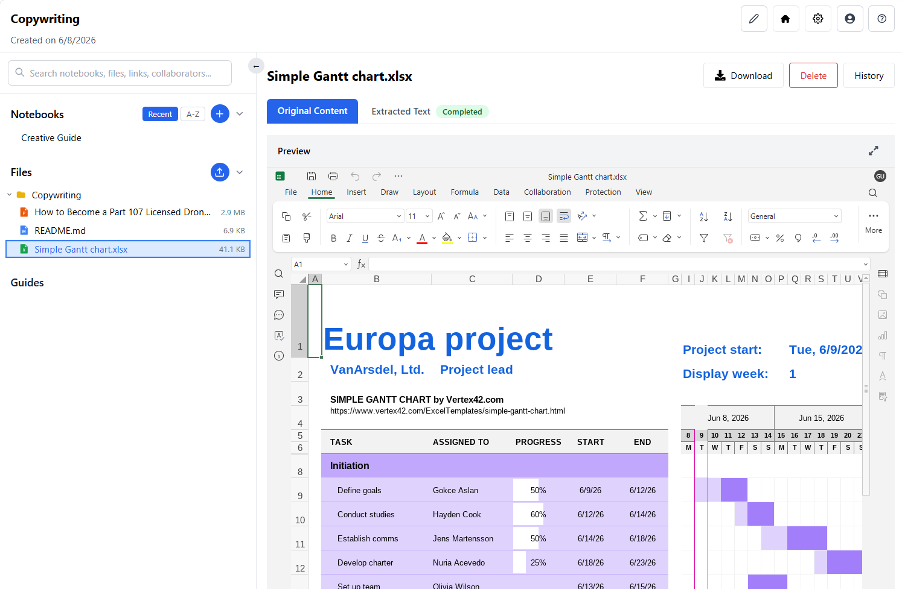
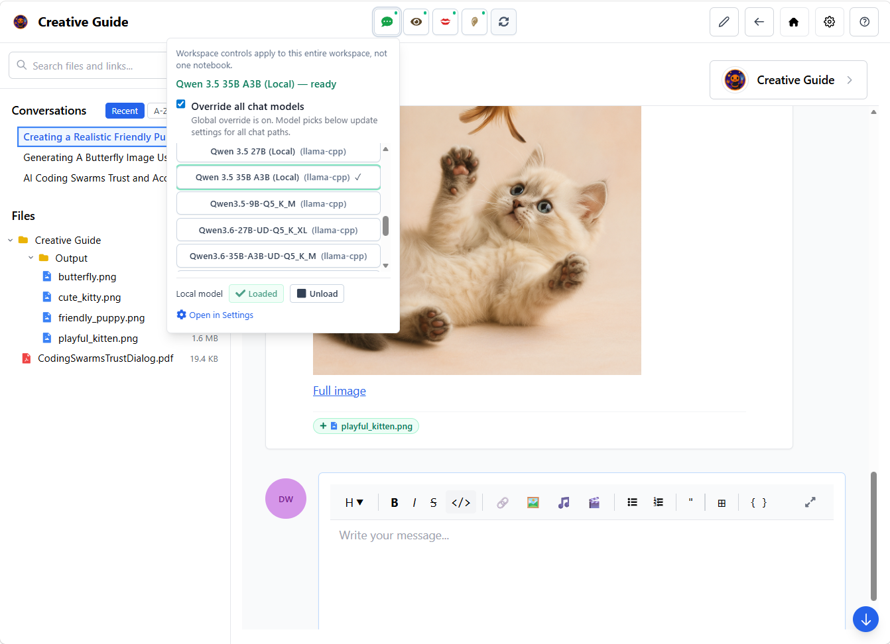
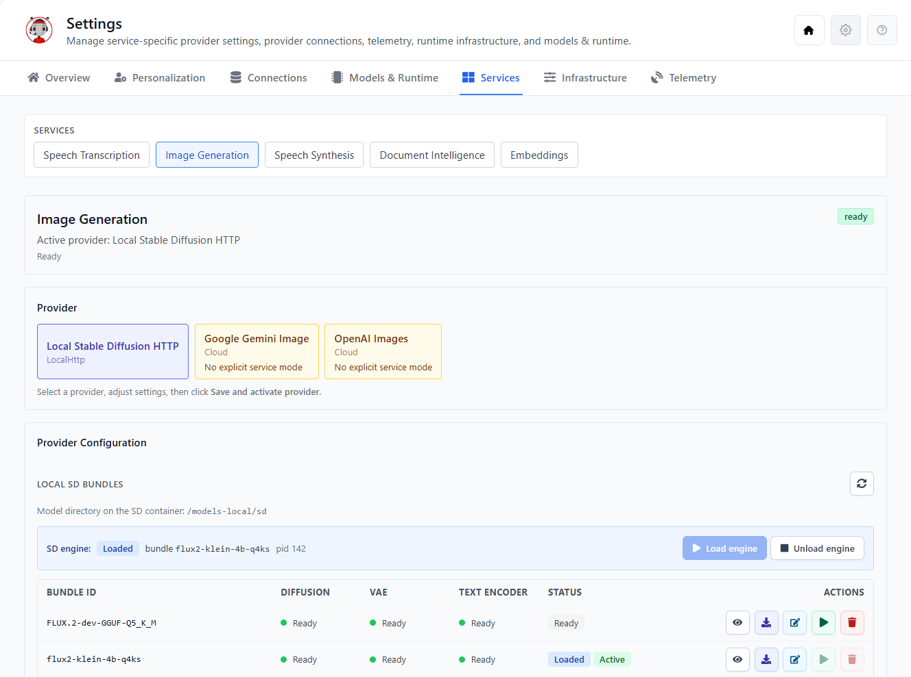
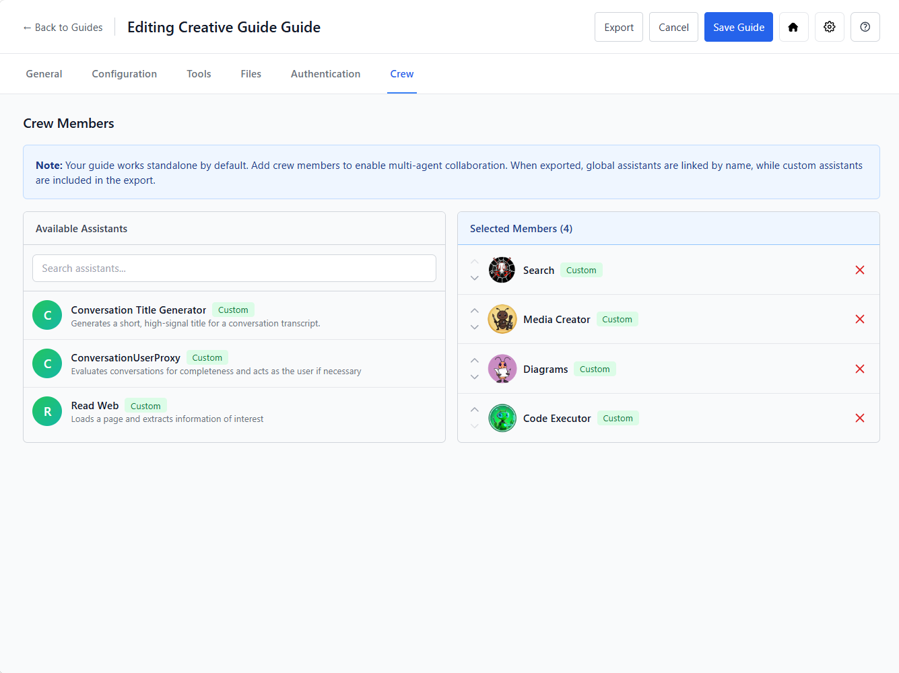
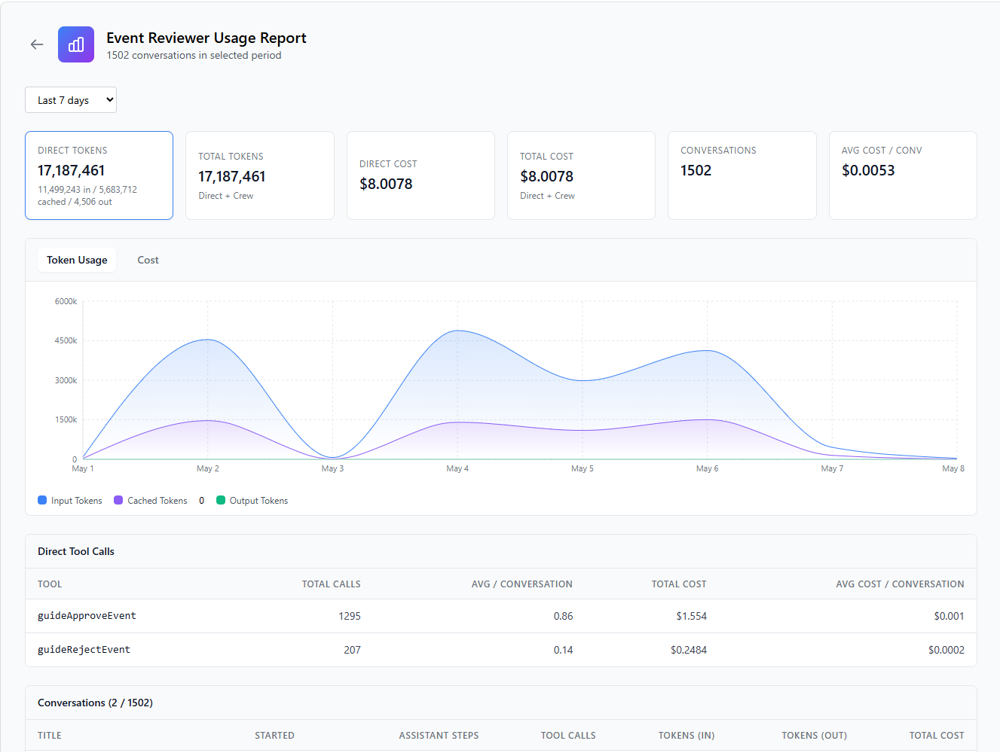

# GuideAnts Notebooks

**Guides + Assistants = Guidance**

AI work that doesn't evaporate. A workspace for building, tuning, and publishing governed AI products.

<table>
  <tr>
    <td></td>
    <td></td>
    <td></td>
    <td></td>
    <td></td>
  </tr>
</table>

GuideAnts gives AI work a real home. Projects, notebooks, documents and source files, conversations, generated artifacts, context, versions, and decisions live together–instead of evaporating into chat history.

Inside that workspace, teams encode repeatable ways of working: guides and assistants that package instructions, tools, files, model choices, and context options into reusable assets anyone can use, modify, and share.

And when a workflow is ready, it doesn't have to stay internal. Publish it with a friendly URL. Embed it in another application with the [`guideants` web component](https://www.npmjs.com/package/guideants). Integrate it into your app's data and workflow. Apply auth, limits, and cost controls. The guide becomes a product surface.

[**Try GuideAnts SaaS →**](https://www.guideants.ai) · [**Self-host GuideAnts →**](#getting-started)

---

## Why GuideAnts

### Your AI work stops evaporating

When AI work happens in a chat, everything important eventually vanishes. The conversation scrolls away. The prompt that worked is gone. The file you uploaded has no link to the output it produced. The decision that shaped the workflow lives in someone's memory.

GuideAnts gives AI work a durable home. Projects, notebooks, source files, conversations, artifacts, context, versions, and decisions all live together. When someone joins the team six months later, they don't start from zero–they inherit the workspace with everything intact.

And because the workspace includes a built-in **document viewer and collaborative editor**, you can open many file formats directly in the notebook–viewing, editing, and versioning them in place without ever leaving the platform. Office documents (DOCX, PPTX, XLSX) and ODF formats (ODT, ODP, ODS) support real-time collaborative editing; Markdown files open in a full-featured editor; many additional formats open for viewing and annotation. Files stay linked to the conversations and guides that produced them.

### From one-off prompts to reusable operating knowledge

Most teams have a few people who know the right prompt, the right model, and the right way to get the AI to do something useful. When those people are unavailable, the workflow breaks.

GuideAnts packages instructions, tools, files, context options, conversation starters, model choices, and validation rules into guides and assistants–reusable assets that encode how work gets done. Anyone on the team can use them without needing to understand the underlying models or prompts.

### From expensive prototype to sustainable product

This is where most AI initiatives stall. Your team builds something impressive with a frontier model. It works. Then someone asks what it costs to run every day, and the answer is terrifying.

Every interaction in GuideAnts is traced: you can see exactly which model handled which message, which assistant drove which cost, which tool invocation mattered, and which step could run on a smaller model without anyone noticing the difference.

[EveryEventEver](https://everyeventever.com/) is the proof. The content in the site is maintained using published guides. The first version ran on a state-of-the-art frontier model and cost hundreds of dollars per day. Using GuideAnts traceability, the team identified which parts of the workflow needed the expensive model and which didn't. The same inference now costs about ten dollars a day.

### From internal workflow to shipped product

A guide isn't just something your team uses internally. Publish it with a friendly URL, drop it into another app with the `guideants` web component, or connect it to your application's data and workflow via public APIs. Apply authentication, usage limits, cost controls, and retention policies.

[See a Power BI integration demo →](https://www.elumenotion.com/demos/powerbi)

---

## Core concepts

| Concept  | What it is |
|----------|----------|
| **Project** | The durable workspace boundary–owns folders, content files, notebooks, guides, assistants, and usage records. |
| **Notebook** | The active working environment inside a project. Conversations, files, artifacts, and context live here. |
| **Guide** | A reusable, shareable AI experience built from instructions, tools, files, model choices, and context options. |
| **Assistant** | A reusable assistant definition that applies guide knowledge consistently across conversations. |
| **Published Guide** | A controlled public entry point for a guide, with auth, limits, usage tracking, and embedding support. |

---

## Working with files

GuideAnts treats documents as first-class workspace citizens, not just uploads:

| Capability | Description |
|----------|----------|
| **In-place viewing** | Open many file formats directly in the notebook–no download required. |
| **Real-time collaborative editing** | Co-edit Office documents (DOCX, PPTX, XLSX) and ODF formats (ODT, ODP, ODS) with your team, with changes versioned and linked to the conversation. |
| **Markdown editor** | Full-featured Markdown editing with live preview, syntax highlighting, and version history. |
| **Content lineage & markdown shadows** | Track file origins, versions, and **markdown shadows**–lightweight Markdown representations extracted via [Docling](https://github.com/docling-project/docling) for efficient indexing and RAG–as files move between project and notebook contexts. |
| **AI-grounded editing** | Guides and assistants can read, reference, and transform file content as context–turning a spreadsheet into a report, a spec into code, or a deck into a summary without copy-pasting. |

---

## Architecture

GuideAnts is a full-stack platform:

- **Backend:** .NET solution with modular API, usage recording, sandbox execution, and provider-routed AI services.
- **Frontend:** React 19 + Vite application with the GuideAnts UI.
- **Runtime:** [`guideants-ai`](https://github.com/Elumenotion/GuideAnts/tree/main/docker) Docker service for scoped tool execution, document intelligence, and local AI workloads.
- **Document workspace:** Built-in viewer and collaborative editor–open many formats in the notebook. Office (DOCX, PPTX, XLSX) and ODF (ODT, ODP, ODS) support real-time co-editing; Markdown has a full-featured editor; many more open for viewing, annotation, and versioning. Changes are tracked as part of your project's content lineage.
- **Embedding:** [`guideants`](https://www.npmjs.com/package/guideants) npm package for embedding published guides into any web application.

Each AI capability–chat, embeddings, document intelligence, image generation, speech transcription, speech synthesis–can be routed to a different local or cloud provider. Your workflow doesn't have to choose one model for everything.

---

## Getting started

GuideAnts runs locally with Docker Compose. OS-specific quickstart scripts are included:

```bash
# Windows
.\quickstart.ps1

# Linux / macOS
./quickstart.sh
```

See the [setup guide](https://github.com/Elumenotion/GuideAnts/blob/main/docs/setup-guide.md) for full instructions and the [developer config guide](https://github.com/Elumenotion/GuideAnts/blob/main/docs/developer-config-guide.md) for configuration options.

### Documentation

All documentation lives in the repository:

- [Setup guide](https://github.com/Elumenotion/GuideAnts/blob/main/docs/setup-guide.md) – installation and configuration
- [Developer config guide](https://github.com/Elumenotion/GuideAnts/blob/main/docs/developer-config-guide.md) – configuration reference
- [Auth flow](https://github.com/Elumenotion/GuideAnts/blob/main/docs/auth-flow.md) – authentication architecture
- [Project and notebook files system](https://github.com/Elumenotion/GuideAnts/blob/main/docs/project-and-notebook-files-system.md) – file and content management
- [LLaMA model management](https://github.com/Elumenotion/GuideAnts/blob/main/docs/llama-model-download-and-runtime-management.md) – local model lifecycle
- [Docker build guide](https://github.com/Elumenotion/GuideAnts/blob/main/docker/guideants-ai-build.md) – building the runtime service
- [Full docs directory](https://github.com/Elumenotion/GuideAnts/tree/main/docs) – architecture, features, test plans, and more

## Development Entry Points

> **New to the codebase?** Read [`docs/developer-config-guide.md`](docs/developer-config-guide.md) first — it is the single source of truth for what to install and how the client, server, and docker lanes hang together.

For day-to-day work, the main entry points are:

- [`docs/developer-config-guide.md`](docs/developer-config-guide.md) for the install checklist and per-lane pre-requisites (client, server, docker)
- [`src/client/package.json`](src/client/package.json) for browser/Electron dev, build, and test commands
- [`src/server/GuideAntsApi.sln`](src/server/GuideAntsApi.sln) for the .NET solution
- [`appsettings.example.json`](appsettings.example.json) and [`appsettings.Development.example.json`](appsettings.Development.example.json) for sanitized config templates
- [`src/server/GuideAntsApi/appsettings.example.json`](src/server/GuideAntsApi/appsettings.example.json) and [`src/server/GuideAntsApi/appsettings.Development.example.json`](src/server/GuideAntsApi/appsettings.Development.example.json) for server-local config structure

Typical work splits into one of three lanes:

- frontend/product work in `src/client`
- API/domain/runtime work in `src/server`
- local infrastructure/runtime work in `docker`

## Big Thanks To Upstream Projects

GuideAnts is built on top of excellent open source work. Huge thanks to the teams and contributors behind these projects:

- [llama.cpp](https://github.com/ggml-org/llama.cpp) for local LLM inference/runtime foundations.
- [stable-diffusion.cpp](https://github.com/leejet/stable-diffusion.cpp) for the local image-generation engine used in `guideants-ai`.
- [Transformers](https://github.com/huggingface/transformers) for model loading and inference integration across local services.
- [sentence-transformers](https://github.com/UKPLab/sentence-transformers) for local embeddings support.
- [Hugging Face Hub](https://github.com/huggingface/huggingface_hub) for model download and management workflows.
- [PyTorch](https://github.com/pytorch/pytorch) for tensor/runtime acceleration across ASR, TTS, and embeddings.
- [FastAPI](https://github.com/fastapi/fastapi) and [Uvicorn](https://github.com/encode/uvicorn) for the local Python service APIs.
- [FFmpeg](https://github.com/FFmpeg/FFmpeg) for media extraction/transcoding.
- [Playwright](https://github.com/microsoft/playwright-python) for browser automation used in local service workflows.
- [Docling](https://github.com/docling-project/docling) for document intelligence and markdown extraction (`docling-serve`).
- [SearXNG](https://github.com/searxng/searxng) for metasearch and web retrieval.
- [PlantUML](https://github.com/plantuml/plantuml) and [Graphviz](https://gitlab.com/graphviz/graphviz) for diagram rendering.
- [Euro-Office DocumentServer](https://github.com/Euro-Office/DocumentServer) and [ONLYOFFICE DocumentServer](https://github.com/ONLYOFFICE/DocumentServer) as compatible `GA_DOCUMENTSERVER_IMAGE` targets for full in-app Office document display and editing capabilities.