# GuideAnts Azure Architecture (azure-slim)

## Service graph

```mermaid
flowchart TB
    subgraph Internet
        User[Browser]
    end

    subgraph ACA["Container Apps Environment"]
        WebUI["guideants-webapi-ui\n(external :8080)"]
        AI["guideants-ai\n(internal)"]
        Docling["docling-serve\n(internal :5001)"]
        PlantUML["plantuml\n(internal)"]
        SearXNG["searxng\n(internal :8080)"]
        DocServer["documentserver\n(internal :8000)"]
    end

    subgraph Platform["Azure Platform Services"]
        SQL[(Azure SQL\nguideants)]
        KV[Key Vault]
        Files[Azure Files]
        LA[Log Analytics]
    end

    User -->|HTTPS| WebUI
    WebUI --> AI
    WebUI --> Docling
    WebUI --> PlantUML
    WebUI --> SearXNG
    WebUI --> DocServer
    WebUI -->|MI| SQL
    WebUI --> KV
    AI --> Files
    PlantUML --> Files
    SearXNG --> Files
    WebUI --> Files
    ACA --> LA
```

## Persistence

| Azure Files share | Mount path | Consumers |
|-------------------|------------|-----------|
| `contentfiles` | `/app/ContentFiles` | webapi-ui, guideants-ai, plantuml |
| `script-agent-state` | `/var/lib/guideants/script-agent-admin` | guideants-ai |
| `searxng-config` | `/etc/searxng` | searxng |
| `searxng-data` | `/var/cache/searxng` | searxng |

SearXNG config is seeded from `docker/volumes/searxng/config/` on first deploy.

## Secrets (Key Vault)

| Secret name | Used by |
|-------------|---------|
| `jwt-signing-key` | webapi-ui |
| `settings-secrets-key-azure-deploy` | webapi-ui (`SettingsSecrets__Keys__azure-deploy`) |
| `script-agent-token` | webapi-ui, guideants-ai, plantuml |
| `script-agent-admin-token` | webapi-ui, guideants-ai |
| `documentserver-jwt-secret` | webapi-ui, documentserver |
| `sql-connection-string` | webapi-ui (MI + client ID, updated post-migration) |

## Deployment phases

1. **Phase 1** (`main.bicep`): RG, VNet, Log Analytics, App Insights, SQL, storage, Key Vault, CAE.
2. **Phase 2** (`apps.bicep`): 6 container apps with env wiring from slim compose.
3. **Phase 3** (`deploy.ps1`): secrets, migrations, SearXNG seed, connection string update.

## Non-goals (v1)

- Entra ID / Microsoft SSO for app login
- ACR or local image builds
- Local AI (llama, ASR, TTS, SD) on Container Apps
- Azure Front Door / WAF
- Automated functional tests beyond container startup
