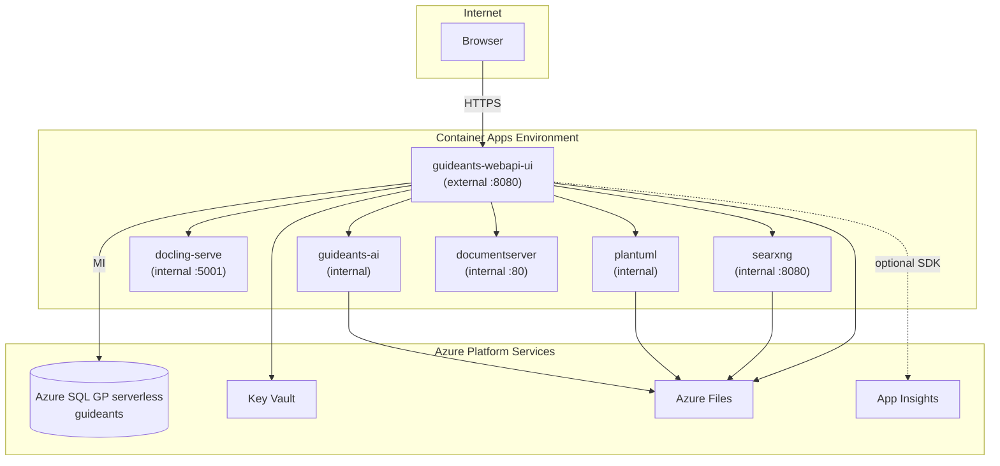

# GuideAnts Azure Architecture (azure-slim)

## Service graph



Console logs: live stream only (`destination: null` on CAE). No ACA → Log Analytics ingest.

## Persistence

| Azure Files share | Mount path | Consumers |
|-------------------|------------|-----------|
| `contentfiles` | `/app/ContentFiles` | webapi-ui, guideants-ai, plantuml |
| `script-agent-state` | `/var/lib/guideants/script-agent-admin` | guideants-ai (scoped SEA state + venvs under `.../scopes/`) |

The `script-agent-state` volume on `guideants-ai` must mount with CIFS `mountOptions` so Linux can create venv symlinks on the share:

```text
mfsymlinks,nobrl,file_mode=0755,dir_mode=0755
```

Without `mfsymlinks`, `python -m venv` under `SCRIPT_EXECUTION_SCOPE_STATE_ROOT` fails on `lib64 -> lib` (`Permission denied`). This is configured in [`modules/container-apps.bicep`](modules/container-apps.bicep) on `script-agent-state-volume`. Evidence: [`docs/azure-deploy-execution/mfsymlinks-venv-evidence.md`](../../docs/azure-deploy-execution/mfsymlinks-venv-evidence.md).
| `searxng-config` | `/etc/searxng` | searxng |
| `searxng-data` | `/var/cache/searxng` | searxng |

SearXNG config is seeded from `docker/volumes/searxng/config/` on first deploy.

## Secrets (Key Vault)

Key Vault uses **access policies** (not RBAC role assignments) so deployment works with **Contributor** only. Phase 1 grants:

- **Deployer** — full secrets access (bootstrap + post-deploy `az keyvault secret set`)
- **Container apps managed identity** (`id-{prefix}-containers-{env}`) — `get`/`list` for ACA secret references

| Secret name | Used by |
|-------------|---------|
| `jwt-signing-key` | webapi-ui |
| `settings-secrets-key-azure-deploy` | webapi-ui (`SettingsSecrets__Keys__azure-deploy`) |
| `script-agent-token` | webapi-ui, guideants-ai, plantuml |
| `script-agent-admin-token` | webapi-ui, guideants-ai |
| `documentserver-jwt-secret` | webapi-ui, documentserver |
| `sql-connection-string` | webapi-ui (MI + client ID, updated post-migration) |

## Deployment phases

1. **Phase 1** (`main.bicep`): RG, VNet, Log Analytics, App Insights, SQL, storage, Key Vault (access policies), container apps MI, CAE.
2. **Phase 2** (`apps.bicep`): 6 container apps with env wiring from slim compose.
3. **Phase 3** (`deploy.ps1`): secrets, migrations, SearXNG seed, connection string update.

## Non-goals (v1)

- Entra ID / Microsoft SSO for app login
- ACR or local image builds
- Local AI (llama, ASR, TTS, SD) on Container Apps
- Azure Front Door / WAF
- Automated functional tests beyond container startup
