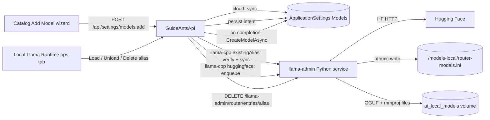

# Add Model wizard and Catalog redesign

Last updated: 2026-04-21

Status: design + execution plan. Supersedes the Phase 2 / Phase 3 client sections of
[`c:\Users\dougl\.cursor\plans\llama-download-end-to-end_65d71aa8.plan.md`](../../Users/dougl/.cursor/plans/llama-download-end-to-end_65d71aa8.plan.md)
(a.k.a. the "llama-download-end-to-end" plan). Phase 1 server work from that plan
is retained and integrated here. Design rationale lives in
[`docs/PlanNotes.md`](PlanNotes.md); this document is the executable plan.

## Why this document exists

The llama-download-end-to-end plan correctly identifies the server-side smells
(silent catalog auto-register, hard-coded reasoning choices, hard-coded
`ResourceGroupKey`, non-persistent intent cache, broken delete cascade) and
fixes them. Its client-side shape, however, bakes in three corners that this
redesign explicitly refuses:

1. **The primary noun is wrong.** "Download & Register" is labelled as a file
   operation that happens to produce a catalog row. The user intent is "add a
   model to my catalog"; for the llama-cpp provider, downloading bytes is an
   implementation detail of that intent, not a separate concept.
2. **Phase 3 scope-dumps.** Deleting the Catalog Create/Edit form entirely
   ("keep table + row-delete") solves the broken llama-cpp branch by deleting
   the create/edit path for every provider. Rename, re-bind profile, change
   description, toggle active all disappear. That is not acceptable for a
   feature we are iterating on.
3. **The "Local Llama Runtime" tab conflates add-flow with ops-flow.** A
   user who lands there looking to install a model and a user who lands there
   to load/unload an installed alias deserve two different surfaces.

Fixing any one of these in isolation re-creates the tangle. The plan below
fixes all three as a single feature.

## Domain model (four concepts, stated cleanly)

| Concept | Lifecycle | Relationships |
|---------|-----------|---------------|
| **Catalog model** | Created via Add Model; updated via Edit; deleted via Catalog row delete. Referenced by assistants. | 1:1 with its `modelId`; N:1 to `Provider`; for llama-cpp, N:1 to `Runtime profile` and N:1 to `Router alias`. |
| **Provider** | Statically defined by the app (`openai-chat`, `openai-responses`, `azure-openai-chat`, `azure-openai-responses`, `anthropic`, `llama-cpp`). | Contributes the shape of the Add/Edit form, and whether the add operation has install side effects. |
| **Runtime profile** | Independent. Created via template or custom form; referenced by catalog rows. | N catalog rows : 1 profile. Usage count gates delete. |
| **Router alias** | llama-cpp-only runtime handle. Created by install (download+register); destroyed by Runtime Inventory → Delete alias. | N catalog rows : 1 alias (N ≥ 0). Has its own state (file present, loaded, in use). |

Every surface problem below is a consequence of the current UI not respecting
that these are four distinct nouns.

## Six workflows, six first-class surfaces

| # | Workflow | Home | Trigger |
|---|----------|------|---------|
| 1 | **Add model** | Catalog (+ Runtime-tab signpost link) | `Add Model` button |
| 2 | **Edit model metadata** | Catalog row | `Edit` icon |
| 3 | **Remove catalog entry only** | Catalog row | `Delete` icon + catalog-only confirm |
| 4 | **Load / unload alias** | Local Llama Runtime → Runtime Inventory | row actions |
| 5 | **Diagnose alias / router** | Local Llama Runtime → Runtime Inventory + Router Mapping | row + read-only tables |
| 6 | **Install catalog entry from existing alias (recovery)** | Catalog → Add Model → provider `llama-cpp` → source `Attach existing alias` | same wizard, alternate source |

The llama-download-end-to-end plan has one surface for (1), nothing for (2),
a coupling of (3) and (4) via the cascading delete, the add surface mixed
into the ops tab for (4) and (5), and no surface at all for (6). Each of
the six gets a home below.

## Design

### D1. `Add Model` is a provider-driven wizard owned by Catalog

Single entry: **Models & Runtime → Catalog → Add Model**. Opens a modal
wizard. Five steps, skippable progress header, never a multi-form page.

#### Step 1 — Choose provider

- List populated from the provider registry (same enum used in
  [`src/client/src/pages/settings/components/ModelsTab.tsx`](../src/client/src/pages/settings/components/ModelsTab.tsx)
  lines 288-308 today).
- Each row shows a **credentials ready?** indicator derived from a
  `GET /api/settings/sections/{section}` probe at wizard open. Unconfigured
  providers are selectable but Step 4 hard-blocks submit with a deep-link
  to **Connections → {section}**. No silent retries.

#### Step 2 — Catalog entry (provider-agnostic)

| Field | Validation |
|-------|------------|
| `modelId` | Non-empty, unique against existing catalog (live probe on blur). |
| `displayName` | Non-empty. |
| `description` | Optional. |
| `resourceGroupKey` | See **D5**. Either enumerated select or read-only `local` pin; never free-text. |
| `displayOrder` | Optional integer; null means "order by `modelId`". |
| `isActive` | Toggle, default on. |

**No default values are injected at submit.** The server accepts nulls
exactly as typed. This is the surface that pays for Phase 1.2's
"derive, don't hard-code".

#### Step 3 — Provider-specific configuration

> Naming note (updated after implementation): the original draft of this
> document called each provider-specific UI contribution a "strategy" in the
> GoF sense. In practice these components only render provider-specific form
> fields chosen via a `switch (provider)` dispatch — they do not implement
> interchangeable algorithms over a shared behavior. The filenames and types
> are therefore `*Form.tsx` / `ProviderAddForm` / `ProviderEditForm`, and
> they live under
> `src/client/src/pages/settings/components/catalog/providers/`. The rest of
> this document uses "provider form" to refer to the same thing.

Each provider contributes the Step 3 content through a client-side provider
form map keyed by provider id. Each provider implements:

```typescript
interface ProviderAddForm {
  provider: string;
  renderStep3(state, onChange): JSX.Element;
  validateStep3(state): ValidationErrors;
  buildSubmitPayload(state): AddModelRequest;   // see D6
}
```

- **`openai-chat` / `openai-responses`**:
  target `openai` model name (e.g. `gpt-4o-2024-08-06`), optional
  `reasoning_effort` toggle when the provider advertises it on its section.
  No install step, no runtime profile.
- **`azure-openai-chat` / `azure-openai-responses`**: deployment name,
  optional api-version override, optional `reasoning_effort`. Credentials
  + endpoint are read from `AzureOpenAI` section; not re-asked here.
- **`anthropic`**: target Anthropic model id, optional
  `thinking_enabled` toggle.
- **`llama-cpp`**: three sub-sections.
  1. **Runtime profile** selector (see **D4**): pick existing / create
     from template / create custom — all inline.
  2. **Router alias** (`routerModelId`): unique against live router
     via `GET /api/settings/llama/runtime/inventory`.
  3. **Source** radio:
     - *Install from Hugging Face* — `repository`, **Model file (GGUF)**,
       **Vision projector (mmproj)**, `targetDirectory`. The operator
       pastes an `owner/repo` (e.g. `unsloth/Qwen3.6-35B-A3B-GGUF`), clicks
       **Browse repository files**, and the wizard calls
       `GET /api/settings/llama/huggingface/repositories/{owner}/{repo}/files`
       which proxies HF's public `tree/main` API server-side (the
       configured HF token is injected there; the browser never sees it).
       Returned files are categorized into `gguf` / `mmproj` / `other` and
       rendered as two dropdowns with size + quant labels. Sharded GGUFs
       are listed but disabled (`llama-server` cannot load a single
       shard). The selected filenames are submitted verbatim as
       `quantIncludePattern` / `mmprojIncludePattern` — the server-side
       matcher anchors and escapes the value so an exact filename matches
       itself. An **Enter filename manually** escape hatch reveals the
       legacy free-text inputs for unreachable HF, exotic filename
       heuristics, or offline use. Pre-flight:
       `GET /api/settings/sections/HuggingFace` → if no token and HF
       returns 401/403 on browse, surface `REPO_TOKEN_MISSING` inline
       with a deep-link to Connections → Hugging Face.
     - *Attach existing alias* — select from the subset of live router
       aliases whose `catalogModelIds.length === 0`. Uses existing
       `LlamaRuntimeInventoryItemDto`. Copies `hasModelFile` /
       `hasMmprojFile` into a read-only preview so the operator sees
       exactly what they are adopting.

> **Naming note.** Earlier drafts of this plan labelled the two HF filename
> fields "Quant Include Pattern" and "mmproj Include Pattern" and exposed them
> as free-text glob boxes (e.g. `*Q5_K_M*`). That vocabulary leaked an
> implementation detail of the server-side matcher onto operators. The shipped
> UI labels the fields **Model file (GGUF)** and **Vision projector (mmproj)**
> and fills them by picking from HF's real file tree. The admin-side matcher
> is unchanged — a literal filename is still a valid pattern (the escape +
> anchor rule treats it as an exact match).

**Derived preview (read-only):** once a runtime profile is selected, a
panel shows "Reasoning choices exposed by this profile:
`[none, enabled]`" — the exact list that will be persisted as
`ReasoningChoicesJson`. If the profile exposes no choices, the panel
reads "This profile exposes no reasoning choices; the catalog row's
`ReasoningChoicesJson` will be `null`." No hidden default anywhere.

#### Step 4 — Review + submit

- Full read-only summary of Steps 2–3.
- Blockers surface as inline banners with action links:
  - `HUGGINGFACE_TOKEN_MISSING` → "Open Connections → Hugging Face".
  - `PROVIDER_CREDENTIALS_MISSING` → "Open Connections → {section}".
  - `RUNTIME_PROFILE_NOT_FOUND` → "Back to Step 3 → pick a profile".
  - `ROUTER_ALIAS_TAKEN` → "Back to Step 3 → change alias".
  - `MODEL_ID_TAKEN` → "Back to Step 2 → change id".
- Single `Create model` button. Atomic server operation (see **D6**).

#### Step 5 — Progress (llama-cpp *Install from Hugging Face* only)

Modal stays open and renders the state machine (see **D7**) as a labelled
checklist with per-step spinners and a bytes-progress bar at the
`Downloading` step. On completion the wizard offers:

- `Load now` — calls existing
  `POST /api/settings/llama/runtime/load` and then closes the wizard.
- `Open in Catalog` — closes, scrolls to the new row.

On failure the wizard offers `Retry from failed step` (requires Phase 1.1's
persisted intent row — retry does **not** re-download if bytes are already
on disk). Cancel closes the wizard; a **Catalog-row badge** labelled
`Installing…` remains on the catalog row so the user can re-open the
progress view, including after a page reload.

### D2. `Local Llama Runtime` tab becomes pure ops

After **D1**, the tab hosts only:

| Section | Today | After |
|---------|-------|-------|
| Download & Register | Primary input form | **Removed.** Replaced by a header hyperlink: *"Add a model"* → routes to Catalog → Add Model with provider preselected to `llama-cpp`. |
| Runtime Inventory | Present | Present. Row actions renamed: `Load`, `Unload`, `Delete alias + files` (replaces today's `Delete`). |
| Router Mapping | Present | Present. Read-only. |
| Runtime diagnostics | Present | Present. Read-only. |

The `Delete alias + files` action surfaces its full semantics in the confirm
dialog: *"This will stop any load, remove the GGUF and mmproj files from
disk, and remove N catalog row(s) that target this alias. This cannot be
undone."* with the list of affected catalog rows enumerated. Still gated
by non-zero notebook reference count from
[`SettingsEndpoints.cs`](../src/server/GuideAntsApi/Endpoints/SettingsEndpoints.cs)
lines 1211-1297, but the cascade matches Phase 1.5 of the source plan.

### D3. Catalog Edit stays, and is provider-scoped

Per-row `Edit` opens a modal with a provider-scoped form strictly smaller
than today's:

| Field | Editable? | Notes |
|-------|-----------|-------|
| `modelId` | **No** | Identity. Rename = delete + re-add. |
| `provider` | **No** | Identity. Changing provider = different model. |
| `displayName` | Yes | |
| `description` | Yes | |
| `resourceGroupKey` | Yes (if enumerable; see D5) | |
| `displayOrder` | Yes | |
| `isActive` | Yes | |
| llama-cpp: `routerModelId` | **No** | Binding to an alias is identity of the catalog row's runtime shape. |
| llama-cpp: `runtimeProfileId` | Yes | Swapping profile may change reasoning choices; the edit form recomputes and shows the derived `ReasoningChoicesJson` inline. |
| llama-cpp: `loadParams` / `parallelToolCalls` | Yes, in an `Advanced` collapsible | |

Edit is **never** the add form re-opened; they share no component. This
eliminates the current flag-based `editingModelId ? 'Edit' : 'Create'`
branching in `ModelsTab.tsx` lines 245 / 427-441.

`Delete` on a Catalog row is **catalog-only**: removes the row, leaves
the alias and files intact. Confirm dialog copy: *"Remove this chat
target from the catalog. The llama runtime alias `{routerModelId}` and
its files will not be affected; delete those from Local Llama Runtime
→ Runtime Inventory if you want to free the bytes."*

This is the single biggest departure from the source plan and is the
reason workflow (3) gets its own surface.

### D4. Inline runtime profile creation from the wizard

The wizard's Step 3 runtime profile control exposes three verbs:

1. **Pick existing** — search/scroll the existing profiles. Usage
   counts shown inline (same source as `profileUsage` in
   [`ModelsTab.tsx`](../src/client/src/pages/settings/components/ModelsTab.tsx)
   lines 191-201).
2. **Create from template** — buttons for the three seeded templates
   (`qwen3_5`, `qwen3_6`, `gemma4`). Idempotent: if the id already
   exists, the wizard selects it rather than erroring.
3. **Create custom** — opens a side panel with the profile editor
   (extracted from `ProfilesTab`). Saving the profile routes the user
   back to Step 3 with the new profile preselected.

Without (2) and (3) inline, "add Qwen3.5 for the first time" still
requires a round-trip. That's the exact trip the source plan is trying
to kill. Inline creation keeps it killed.

### D5. Resource group: design, don't relocate

`ResourceGroupKey` is currently:

- Hard-coded to `"local"` in
  [`HuggingFaceModelDownloadService.cs`](../src/server/GuideAntsApi/Services/LlamaCpp/HuggingFaceModelDownloadService.cs)
  line 192.
- Free-text in
  [`ModelsTab.tsx`](../src/client/src/pages/settings/components/ModelsTab.tsx)
  lines 356-363.
- Required by `LocalRuntimeConfiguration` (see
  [`LocalRuntimeConfiguration.cs`](../src/server/GuideAntsApi/Services/LlamaCpp/LocalRuntimeConfiguration.cs)
  line 8) and serialized at line 148.
- Read by `NotebookModelRuntimeService` lines 85 and 400.

Promoting it to wire-level on `StartModelDownloadRequest` (source plan
Phase 1.2) without defining its domain would just move the hidden default
from the server to the client. This plan takes a definitive position:

**Decision point — make one of these two choices explicitly before any
code ships:**

- **Option A — treat it as a real scheduling dimension.** Define a
  `ResourceGroup` aggregate backed by a new `ResourceGroups` table
  (`Key PK`, `DisplayName`, `Description`, `CreatedUtc`), admin-service
  endpoint `GET /llama-admin/resource-groups`, and a Settings UI sub-tab
  for CRUD (deferrable, but the seed `local` row is written on startup).
  Wizard Step 2 renders an enumerated `<select>` populated from that
  endpoint. Runtime effect is documented in
  [`settings-page-provider-model-llama-redesign.md`](settings-page-provider-model-llama-redesign.md).
- **Option B — acknowledge it is a single-value pin today.** Keep the
  field in the persisted shape (for forward-compat), but render it as
  a read-only `local` badge on the wizard and the edit form with a
  tooltip: *"Resource grouping is not yet used at runtime; reserved
  for multi-pool scheduling."* Server rejects any other value with
  `RESOURCE_GROUP_UNKNOWN`. This is explicit inactivity, not a
  silent default.

Ship **Option A** if multi-pool scheduling is on the 6-month roadmap;
otherwise ship **Option B**. What we do **not** ship: a free-text
input that looks like it does something. Pick before Phase 2 starts;
document the decision in the commit message.

### D6. Unified `POST /api/settings/models:add` endpoint

Today there are two disjoint add paths:

- `POST /api/settings/models` (via
  [`api.settings.createModel`](../src/client/src/services/api.ts)) for
  cloud providers.
- `POST /api/settings/llama/downloads` for llama-cpp, which also creates
  a catalog row as a side effect (the thing Phase 1 fixes).

Collapse into one conceptual endpoint so the wizard has one submit call
regardless of provider:

```
POST /api/settings/models:add
Content-Type: application/json

{
  "provider": "llama-cpp" | "openai-chat" | ...,
  "catalog": {
    "modelId": string,
    "displayName": string,
    "description": string | null,
    "resourceGroupKey": string | null,
    "displayOrder": number | null,
    "isActive": bool
  },
  "providerConfig": {                   // shape varies by provider
    ...provider-specific fields...
  },
  "install": {                          // llama-cpp only
    "source": "huggingface" | "existingAlias",
    "routerModelId": string,
    "runtimeProfileId": string,
    "huggingface": {                    // source === "huggingface"
      "repository": string,
      "quantIncludePattern": string,
      "mmprojIncludePattern": string,
      "targetDirectory": string
    } | null,
    "existingAlias": {                  // source === "existingAlias"
      "routerModelId": string
    } | null
  } | null
}
```

Response shape:

```
{
  "operationId": string | null,   // null for cloud providers (sync)
  "addOperation": {
    "kind": "sync" | "async",
    "catalogModel": SettingsModelDto | null,   // populated when sync
    "status": "completed" | "inProgress",
    "error": { code, step, message, remediation } | null
  }
}
```

Internally:

- Cloud providers → synchronous; calls `IApplicationSettingsService.CreateModelAsync`,
  returns the `SettingsModelDto`.
- `llama-cpp` + `existingAlias` → synchronous; validates the alias exists
  and has the GGUF+mmproj present, then calls `CreateModelAsync`. No
  intent row needed.
- `llama-cpp` + `huggingface` → asynchronous; writes the
  `DownloadCatalogIntents` row (Phase 1.1), calls admin-service
  `/downloads`, returns `operationId`.

The existing `POST /api/settings/llama/downloads` endpoint stays
internally but is called only by the unified endpoint; it is no longer
the public entry point. This matches the "provider determines fields"
truth at the API layer, not just the UI.

### D7. State machine and error surface

Normalize the pipeline so the UI and docs describe the same steps:

```
queued
  → resolvingFiles       (HF metadata lookup)
  → downloading          (bytes; emits progress fraction)
  → registeringAlias     (atomic router-ini write)
  → registeringCatalog   (IApplicationSettingsService.CreateModelAsync)
  → completed
  | failed { code, step, message, remediation }
```

- `catalogRegistering` (name used by the source plan) becomes
  `registeringCatalog` for parallel construction with
  `registeringAlias`.
- The UI never reads the enum string directly. A single
  `ADD_MODEL_STEPS` table in the client maps step id → display label
  → short help copy. Server copy changes never require client
  re-translation.
- Failures carry structured `{ code, step, message, remediation }` so
  the client maps `code` → UI banner without substring matching.
- Phase 1.1's intent persistence means `Retry from failed step` after a
  `registeringCatalog` failure does not re-download bytes.

### D8. `docs/setup-guide.md` is rewritten around the wizard

Rewrites, not patches:

- **§6 Step 3** — drop the three-sub-tab description. Replace with three
  workflows:
  - *Add a model* → Catalog → Add Model.
  - *Operate a local llama alias* → Local Llama Runtime → Runtime
    Inventory.
  - *Create a sampling preset* → Runtime Profiles → Add Profile (or
    inline from the wizard). Runtime Profiles also supports client-side
    import/export of profile JSON.
- **§7** — Qwen3.5-9B-Q5_K_M walk-through via the wizard (see below for
  the exact field values; these also drive CP2–CP4).
- **§7b** — new. Add a cloud model (`openai-chat`, e.g. `gpt-4o`) via
  the same wizard. Proves the wizard is the unified entry and that
  cloud providers have a real add path.
- **§7c** — new. Attach existing alias recovery scenario. Scenario: the
  GGUF+mmproj are on disk and the router entry exists (e.g. from a
  migration or a manual copy), but no catalog row. Use Add Model →
  `llama-cpp` → source `Attach existing alias`.
- **§11 Troubleshooting** — entries for each structured failure code
  the wizard surfaces: `HUGGINGFACE_TOKEN_MISSING`,
  `PROVIDER_CREDENTIALS_MISSING`, `RUNTIME_PROFILE_NOT_FOUND`,
  `ROUTER_ALIAS_TAKEN`, `MODEL_ID_TAKEN`, `RESOURCE_GROUP_UNKNOWN` (if
  Option A), `INSTALL_STEP_FAILED` per step.

## Architecture anchors (what we are not moving)



Web API continues to never touch the model volume (R-7.5 / R-7.6).

## Plan

### Phase 0 — Resource group decision (blocking)

- **0.1** Pick **Option A** or **Option B** from **D5**. Document in
  [`docs/settings-page-provider-model-llama-redesign.md`](settings-page-provider-model-llama-redesign.md).
  Until this lands, Phase 2 does not start.

### Phase 1 — Server correctness (inherits from the llama-download-end-to-end plan)

Phase 1.1-1.6 from the source plan are retained **with these amendments**:

- **1.2 amended.** `ReasoningChoicesJson` is derived from the runtime
  profile's `thinkingControlJson.choiceActions`, or `null` when empty.
  No hard-coded fallback. `DisplayOrder` is `null` unless the request
  specifies one.
- **1.2 amended.** `ResourceGroupKey` is required on the wire, value
  enforced by Phase 0's decision:
  - Option A: server validates against the `ResourceGroups` table;
    unknown → 400 `RESOURCE_GROUP_UNKNOWN`.
  - Option B: server accepts only `"local"`; any other → 400
    `RESOURCE_GROUP_UNKNOWN` with remediation pointing at the roadmap
    item.
- **1.3 amended.** State enum renamed `catalogRegistering` →
  `registeringCatalog`; matching rename in
  [`llama_admin_service.py`](../docker/build/guideants-ai/llama-admin-service/llama_admin_service.py).
- **1.5 amended.** Delete cascade from
  [`SettingsEndpoints.cs`](../src/server/GuideAntsApi/Endpoints/SettingsEndpoints.cs)
  lines 1211-1297 retained exactly. Clarify the confirm copy on the
  client per **D2** — this is the "delete alias + files + catalog
  rows" operation. The per-catalog-row delete in **D3** is a separate
  server path, `DELETE /api/settings/models/{id}`, which is unchanged
  (and which notably does **not** cascade to the alias).

### Phase 2 — `POST /api/settings/models:add` unified endpoint

- **2.1** Add `AddModelRequest`, `AddModelResponse`, provider-specific
  `ProviderConfig` DTOs to
  [`SettingsDtos.cs`](../src/server/GuideAntsApi/Models/Settings/SettingsDtos.cs).
- **2.2** Implement endpoint in
  [`SettingsEndpoints.cs`](../src/server/GuideAntsApi/Endpoints/SettingsEndpoints.cs):
  - Validates provider is known.
  - Validates catalog block (unique `modelId`, resource group per Phase 0).
  - Routes cloud providers to `IApplicationSettingsService.CreateModelAsync`
    synchronously; returns `AddModelResponse { kind: "sync", catalogModel }`.
  - Routes llama-cpp `existingAlias` to a new
    `IHuggingFaceModelDownloadService.AttachExistingAliasAsync` that
    verifies via `ILlamaRuntimeAdminClient` + `ILlamaRuntimeInventoryService`
    and then calls `CreateModelAsync`.
  - Routes llama-cpp `huggingface` to
    `IHuggingFaceModelDownloadService.StartDownloadAsync` (now accepting
    the full add payload, not just the download portion).
- **2.3** Validate Hugging Face token presence *at submit* for the
  `huggingface` source via `IHuggingFaceTokenResolver.Resolve()`; return
  400 `HUGGINGFACE_TOKEN_MISSING` with remediation URL.
- **2.4** Error responses are all
  `{ code, step: "validation" | "<state-machine-step>", message, remediation }`
  shape, never bare strings.
- **2.5** Tests:
  - Cloud add happy path.
  - llama-cpp `existingAlias` happy path (alias exists, files present) →
    synchronous catalog row.
  - llama-cpp `existingAlias` bad cases: alias not in router, files
    missing, alias already has catalog rows.
  - llama-cpp `huggingface` happy path (continuation of Phase 1 tests).
  - All validation 400s surface structured errors.

### Phase 3 — Client wizard + catalog edit split

- **3.1** New `AddModelWizard` component under
  `src/client/src/pages/settings/components/catalog/AddModelWizard.tsx`:
  - Modal shell with header step indicator.
  - Step 1 provider picker.
  - Step 2 generic catalog fields.
  - Step 3 provider form map (see below).
  - Step 4 review + submit.
  - Step 5 progress (for async operations) with the `ADD_MODEL_STEPS`
    label map.
- **3.2** Provider forms under
  `src/client/src/pages/settings/components/catalog/providers/`:
  - `OpenAiChatForm.tsx`
  - `OpenAiResponsesForm.tsx`
  - `AzureOpenAiChatForm.tsx`
  - `AzureOpenAiResponsesForm.tsx`
  - `AnthropicForm.tsx`
  - `LlamaCppForm.tsx` (hosts the source selector, inline profile
    creation, alias uniqueness probe).
  (See the naming note in D1 Step 3 — these are not GoF "strategies", they
  are provider-specific form renderers dispatched by a `switch (provider)`.)
- **3.3** New `CatalogRowEditModal` under
  `src/client/src/pages/settings/components/catalog/CatalogRowEditModal.tsx`.
  Uses the same provider form components in "edit" mode (identity
  fields disabled, install/source sections hidden).
- **3.4** Rewrite
  [`ModelsTab.tsx`](../src/client/src/pages/settings/components/ModelsTab.tsx):
  remove the in-place Create/Edit form (lines 241-443). Keep and clean up
  the table + readiness badges (lines 445-578). `Add Model` button
  opens `AddModelWizard`. Per-row `Edit` opens `CatalogRowEditModal`.
  Per-row `Delete` uses catalog-only semantics per **D3**.
- **3.5** Rewrite
  [`LocalLlamaRuntimeTab.tsx`](../src/client/src/pages/settings/components/LocalLlamaRuntimeTab.tsx):
  remove the Download & Register section (lines 223-367) and its state
  (`downloadForm`, `downloadSubmitting`, `downloadError`,
  `handleDownloadSubmit`, the `defaultDownloadForm` constant with its
  Qwen3.6 embedded defaults on lines 38-48). Add a header paragraph with
  a `Add a model` link that navigates to Catalog → Add Model with
  `provider=llama-cpp` preselected. Row actions relabelled per **D2**.
- **3.6**
  [`ModelsRuntimeWorkspace.tsx`](../src/client/src/pages/settings/components/ModelsRuntimeWorkspace.tsx):
  drop the props that the retired in-place form consumed
  (`editingModelId`, `modelForm`, `modelSaving`, `onModelFormChange`,
  `onGuidedLocalRuntimeChange`, `onLocalRuntimeJsonChange`,
  `onResetModelForm`, `onSaveModel`, `onEditModel`,
  `activeDownloadOperationId`, `onDownloadStarted`, `onDownloadTerminal`
  for the old code path). Route
  `activeDownloadOperationId` into Catalog so the row-level badge from
  **D1** has a source.
- **3.7** Update
  [`Settings.tsx`](../src/client/src/pages/Settings.tsx) to drop
  `modelForm` / `editingModelId` / `modelSaving` / `handleModelFormChange` /
  `handleEditModel` / `handleSubmitModel` state; introduce
  `wizardOpen: boolean`, `wizardProviderPreselect: string | null`,
  `activeAddOperation: { operationId, routerModelId, catalogModelId } | null`
  (survives page navigation so the row badge and progress view are
  recoverable).
- **3.8**
  [`src/client/src/pages/settings/types.ts`](../src/client/src/pages/settings/types.ts):
  `ModelFormState` is retired; introduce
  `AddModelWizardState`, `CatalogEditState`.
- **3.9**
  [`src/client/src/pages/settings/utils.ts`](../src/client/src/pages/settings/utils.ts):
  retire `createEmptyModelForm`, `buildModelRequest`,
  `buildCanonicalLocalRuntimeFromGuidedForm`; introduce
  `buildAddModelRequest`, `buildCatalogEditRequest` as pure functions
  covered by unit tests.
- **3.10**
  [`src/client/src/services/api.ts`](../src/client/src/services/api.ts):
  add `api.settings.addModel(request)` + `api.settings.attachExistingAlias`
  (thin wrapper over the unified endpoint); `api.settings.createModel`
  removed, `api.settings.updateModel` retained for the edit modal.

### Phase 4 — Runtime profile inline creation

- **4.1** Extract the Runtime Profile editor from
  [`ProfilesTab.tsx`](../src/client/src/pages/settings/components/ProfilesTab.tsx)
  into a reusable `<RuntimeProfileEditor mode="inline" />`.
- **4.2** Use it inside `LlamaCppForm` Step 3 (the "Create custom"
  affordance).
- **4.3** Template-insert buttons (`qwen3_5`, `qwen3_6`, `gemma4`) live
  in both the sub-tab and the wizard; share the existing endpoint.

### Phase 5 — Documentation

- **5.1** Rewrite [`docs/setup-guide.md`](setup-guide.md) §6 Step 3 and
  §7 per **D8**. Add §7b (cloud add) and §7c (attach existing alias
  recovery). Update §11 Troubleshooting.
- **5.2** Update
  [`docs/llama-model-download-and-runtime-management.md`](llama-model-download-and-runtime-management.md):
  describe the unified endpoint, the intent persistence, the cascading
  alias delete, the state machine rename.
- **5.3** Update
  [`docs/settings-and-llama-completion-requirements.md`](settings-and-llama-completion-requirements.md):
  R-6.* for the wizard, R-6.9 for `POST /api/settings/models:add`,
  R-10.4 for the catalog-only delete semantics (update, not remove —
  catalog delete is back).
- **5.4** Update
  [`docs/settings-page-provider-model-llama-redesign.md`](settings-page-provider-model-llama-redesign.md)
  with the resource-group decision from Phase 0 and the
  Add/Edit/Attach/Delete separation.
- **5.5** Update
  [`docker/llama/README.md`](../docker/llama/README.md) to point the
  "how do I add a model" section at Catalog → Add Model.

### Phase 6 — Build, ship, validate

- **6.1** `docker/build/build_webapi_ui.ps1` to rebuild `guideants-webapi-ui`;
  `docker/build/build_guideants_ai.ps1` (or equivalent) when
  `llama_admin_service.py` changed (state-machine rename).
- **6.2** `dotnet build src/server/GuideAntsApi/GuideAntsApi.csproj` and
  `npm --prefix src/client run type-check` as gates (not acceptance).

### Phase 7 — Acceptance via `playwright-cli`

All acceptance runs the live UI at `http://localhost:5107/settings`.

| CP | Scenario |
|----|----------|
| **CP0** | Add Model wizard from Catalog, provider `llama-cpp`, source `Install from Hugging Face`, `unsloth/Qwen3.5-9B-GGUF` Q5_K_M (see field map in §7). Catalog row auto-creates on `registeringCatalog → completed`. Same bytes as today's CP2 but entered through the wizard. |
| **CP1** | Guards. Submit with: empty runtime profile; missing HF token; unknown provider credentials; duplicate `modelId`. Each surfaces inline by `code`, no network call for the first two; network 400 with structured error for the rest. |
| **CP2** | After CP0, Runtime Inventory shows `runtimeState=unloaded`, `hasModelFile=Yes`, `hasMmprojFile=Yes`, Catalog models column contains the wizard-created id. |
| **CP3** | Runtime Inventory → `Load` transitions `unloaded → loading → loaded`. |
| **CP4** | Overview → Default Chat Model lists the new catalog row; a chat turn in a notebook pinned to it returns a response. |
| **CP5** | Idempotent re-install via Add Model wizard with same alias + `allowOverwrite=true`. Exactly one catalog row, one router entry, no orphaned files. |
| **CP6** | Runtime Inventory → `Delete alias + files` cascades: row gone, catalog row gone, router entry gone, files gone. Notebook reference count == 0. |
| **CP7** | Same as CP6 but notebook reference count > 0 → 409 with remediation text. |
| **CP8** | Add Model wizard with provider `openai-chat`, e.g. `gpt-4o-2024-08-06`. Synchronous add. Overview shows the row; chat turn dispatches against OpenAI. This is the proof point that the wizard is provider-agnostic. |
| **CP9** | Attach existing alias recovery. Manually delete a catalog row (via `DELETE /api/settings/models/{id}`) while keeping the alias. Add Model wizard → `llama-cpp` → source `Attach existing alias` → picks the now-orphaned alias → synchronous add → Overview shows the row → chat turn works without a re-download. |
| **CP10** | Catalog row Edit. Change display name and runtime profile on the CP0 row. Row updates; runtime alias untouched; a subsequent chat turn continues to work. |
| **CP11** | Catalog row Delete (catalog-only). CP0 row removed; Runtime Inventory still shows the alias with `catalogModelIds=[]`; `Delete alias + files` now becomes available on Runtime Inventory. |

### Qwen3.5-9B-Q5_K_M wizard field values (used in CP0, §7 of the setup guide)

- Step 1: provider = `llama-cpp`
- Step 2:
  - `modelId`: `Qwen3.5-9B-Q5_K_M-local`
  - `displayName`: `Qwen3.5 9B Q5_K_M (Local)`
  - `description`: *(blank)*
  - `resourceGroupKey`: per Phase 0 decision (`local` under Option B;
    select `local` from the enumerated list under Option A)
  - `displayOrder`: *(blank)*
  - `isActive`: on
- Step 3:
  - Runtime profile: pick existing `qwen3_5` (or click
    `Insert Qwen3.5 template` from the inline creator if missing)
  - `routerModelId`: `Qwen3.5-9B-Q5_K_M`
  - Source: `Install from Hugging Face`
  - `repository`: `unsloth/Qwen3.5-9B-GGUF`
  - Click **Browse repository files** and pick from the dropdowns:
    - Model file (GGUF): `Qwen3.5-9B-Q5_K_M.gguf` (~6.58 GB)
    - Vision projector (mmproj): `mmproj-F16.gguf`
  - The wizard writes these filenames into `quantIncludePattern` and
    `mmprojIncludePattern` respectively; no glob syntax required. The
    **Enter filename manually** toggle is the legacy free-text path
    (still accepts `*` wildcards) for HF outages or exotic filenames.
  - `targetDirectory`: `Qwen3.5-9B-Q5_K_M`

The model card that sourced these values is preserved in the local upload
staging area as `Qwen3.5-9B-GGUF-0.md`
(see `Files and versions` → `Qwen3.5-9B-Q5_K_M.gguf`, 6.58 GB).

## Non-goals

- Qwen3.6 preset walk-through (kept as a `setup-guide.md` reference but not
  the CP0 path).
- Cross-provider catalog editing that changes `provider` or `modelId` —
  identity is identity.
- Migrating the router preset file format.
- Any `| cat` usage. Any "fallback" logic. Any free-text
  `resourceGroupKey` input.

## Traceability to PlanNotes.md

| PlanNotes §         | Realized in              |
|---------------------|--------------------------|
| Domain model (4 concepts) | **D1-D3**, table at the top of this doc |
| 6 workflows | "Six workflows" table, phases 2-3 |
| §1 Add Model wizard | **D1**, Phase 3 |
| §2 Local Llama Runtime → ops only | **D2**, Phase 3.5 |
| §3 Catalog Edit stays | **D3**, Phase 3.3-3.4 |
| §4 Inline profile creation | **D4**, Phase 4 |
| §5 Resource group designed | **D5**, Phase 0 |
| §6 State machine / error surface | **D7**, Phase 1.3 + Phase 3.1 |
| §7 setup-guide.md rewrites | **D8**, Phase 5.1 |
| Implications: new phase between 1 and 2 | Phase 0 (blocking on resource group) |
| Implications: Phase 2 grows, Phase 3 flips | Phases 2, 3 |
| Implications: Phase 4 docs adds setup-guide | Phase 5.1 |
| Implications: CP0, CP8, CP9, CP10 | Phase 7 (also adds CP11) |
