# Adding Models in Settings

This guide walks through adding cloud models via **Settings → Models & Runtime**, with special attention to configuring Runtime Profiles.

Last updated: 2026-05-20

---

## Overview

Models in GuideAnts are registered in a **Catalog**. Each catalog entry binds a provider (e.g. Google Gemini API, OpenAI) to a model ID and, optionally, a **Runtime Profile** that controls sampling parameters (Temperature, Top P) and reasoning effort exposed in guide and assistant builders.

Before adding a model, make sure the corresponding provider connection is configured under **Settings → Connections**.

---

## 1. Navigate to Models & Runtime

Open **Settings** from the home page, then click the **Models & Runtime** tab in the left navigation.

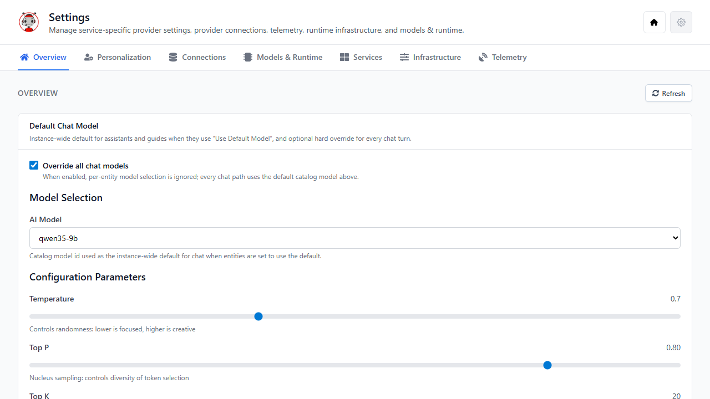

The Models & Runtime workspace has three sub-tabs:

| Sub-tab | Purpose |
|---|---|
| **Catalog** | Add, edit, and delete model registrations |
| **Runtime Profiles** | Define sampling and reasoning parameters per provider |
| **Local Llama Runtime** | Manage locally-hosted llama.cpp models |

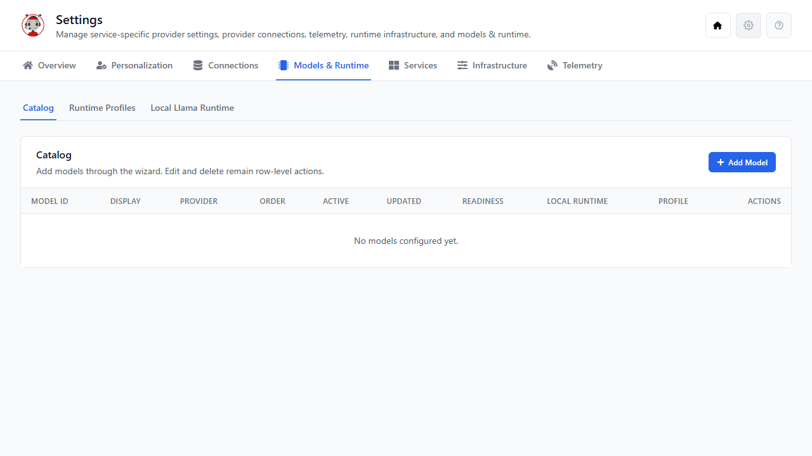

---

## 2. Runtime Profiles

Runtime Profiles are the bridge between a provider's API capabilities and the controls exposed in guide and assistant builders. A profile declares:

- **Providers** — which provider IDs it applies to (e.g. `google-gemini-chat`, `openai-chat`)
- **Sampling Parameters JSON** — sliders like Temperature and Top P shown in the builder Configuration tab
- **Thinking Control JSON** — reasoning effort choices (none / low / medium / high) and the API actions dispatched for each choice

Navigate to **Runtime Profiles** to see all seeded profiles:

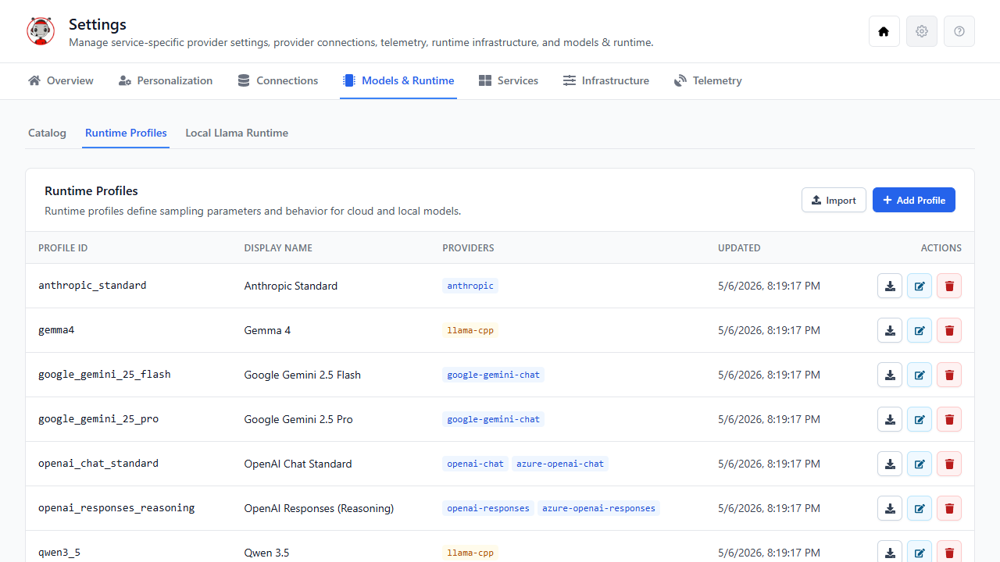

Seeded profiles ship with GuideAnts for each supported provider family:

| Profile ID | Providers | Capabilities |
|---|---|---|
| `openai_chat_standard` | `openai-chat`, `azure-openai-chat` | Temperature, Top P |
| `openai_responses_reasoning` | `openai-responses`, `azure-openai-responses` | Reasoning effort (minimal/low/medium/high) |
| `anthropic_standard` | `anthropic` | Temperature, Top P, thinking effort |
| `google_gemini_25_flash` | `google-gemini-chat` | Temperature, Top P, thinking budget (none/low/medium/high) |
| `google_gemini_25_pro` | `google-gemini-chat` | Temperature, Top P, thinking budget (low/medium/high) |
| `qwen3_5`, `qwen3_6`, `gemma4` | `llama-cpp` | Full local parameters + thinking control |

### 2.1 Editing an Existing Profile

Click **Edit** on any profile row to open the profile editor. The fields available depend on the profile's providers:

- **Cloud profiles** (`openai-chat`, `anthropic`, `google-gemini-chat`, etc.) — show Sampling Parameters JSON and Thinking Control JSON only
- **Local profiles** (`llama-cpp`) — additionally show Combine System/Developer Messages, Thought Block Pattern, and template shortcuts

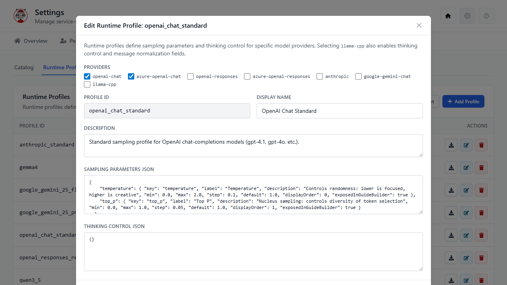

**Sampling Parameters JSON** is a dictionary of parameter definitions. Each entry specifies:

```json
{
  "temperature": {
    "key": "temperature",
    "label": "Temperature",
    "description": "Controls randomness",
    "min": 0.0,
    "max": 2.0,
    "step": 0.1,
    "default": 1.0,
    "displayOrder": 0,
    "exposedInGuideBuilder": true
  }
}
```

Set `exposedInGuideBuilder: true` for parameters that should appear as sliders in guide and assistant configuration panels. Set it to `false` for parameters you want to persist in requests without exposing to users.

**Thinking Control JSON** maps reasoning effort choices to API actions:

```json
{
  "defaultChoice": "medium",
  "choiceActions": {
    "none": [],
    "low": [],
    "medium": [],
    "high": []
  }
}
```

For cloud providers the action lists are typically empty — the reasoning effort string is forwarded directly to the provider. For local llama.cpp models, actions can set request fields or inject system message prefixes.

### 2.2 Creating a New Profile

Click **Add Profile**. Fill in:

1. **Providers** (checkboxes) — select every provider ID this profile should be selectable for
2. **Profile ID** — lowercase letters, digits, and underscores only (e.g. `my_openai_profile`)
3. **Display Name** — shown in UI dropdowns
4. **Sampling Parameters JSON** and **Thinking Control JSON**

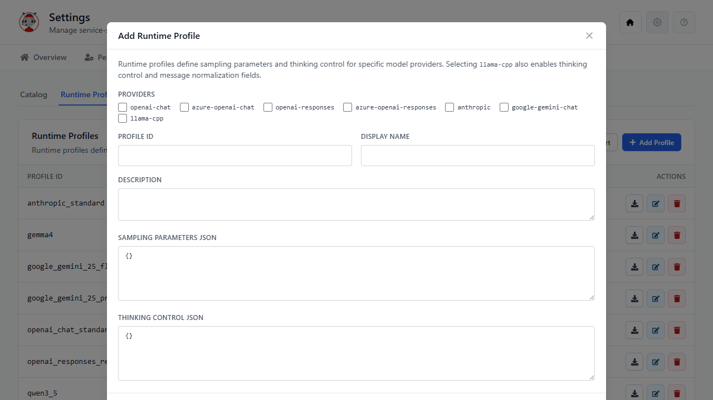

> **Tip:** If you check `llama-cpp` under Providers, the editor gains additional fields for message normalization and thought-block stripping, and template buttons (Insert qwen3_5, Insert qwen3_6, Insert gemma4) appear to pre-fill JSON with known-good configurations.

---

## 3. Adding a Model — Step-by-Step Walkthrough

Switch to the **Catalog** sub-tab and click **Add Model**.


The wizard walks through five steps.

For local llama-cpp onboarding, both this Settings wizard and Home's Add AI Services Wizard now use the same canonical backend command flow through `POST /api/settings/models:add`, shared validation, shared status mapping, and shared operation polling behavior.

### Step 1 — Choose Provider

Select the API integration that serves this model. The provider must be connected under **Settings → Connections** for the model to reach "Ready" readiness.

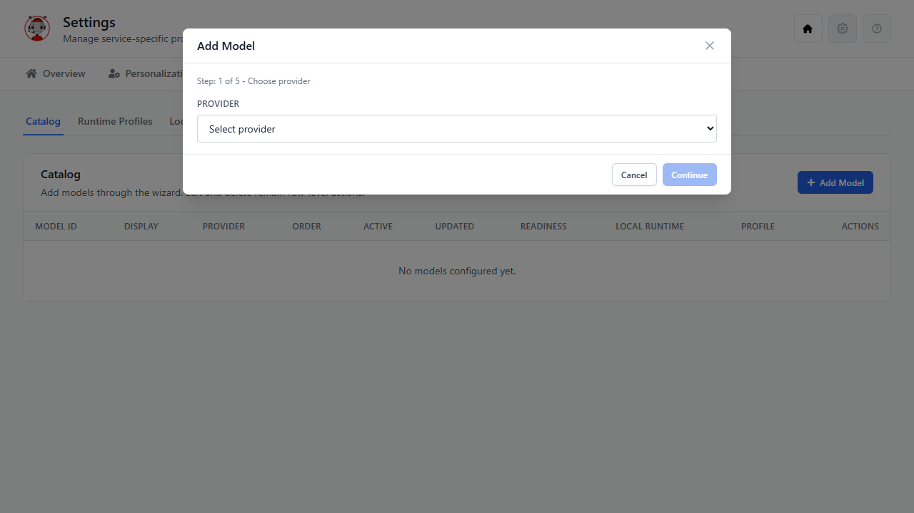

Available providers:

| Display name | Provider ID |
|---|---|
| OpenAI (Completions) | `openai-chat` |
| OpenAI (Responses) | `openai-responses` |
| Microsoft Foundry (Completions) | `azure-openai-chat` |
| Microsoft Foundry (Responses) | `azure-openai-responses` |
| Anthropic | `anthropic` |
| Llama.cpp | `llama-cpp` |
| Google Gemini API | `google-gemini-chat` |
| Hugging Face Inference | `hf-inference-chat` |
| OpenRouter | `openrouter-chat` |

Select a provider and click **Continue**.

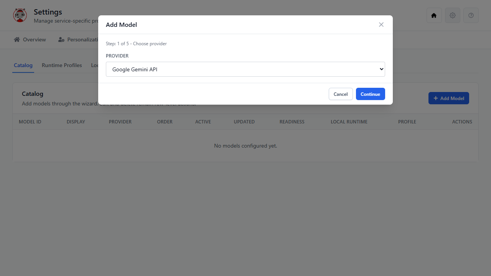

### Step 2 — Catalog Entry

Enter the model's identity as it appears in catalog listings and dropdowns:

| Field | Description |
|---|---|
| **Model ID** | The provider's canonical model identifier (e.g. `gemini-2.5-flash-preview-05-20`). Must be unique across the catalog. |
| **Display Name** | Human-readable label (e.g. `Gemini 2.5 Flash`) |
| **Description** | Optional description shown in model selectors |
| **Display Order** | Integer sort position; lower numbers appear first |
| **Active** | Uncheck to hide the model from selection without deleting it |

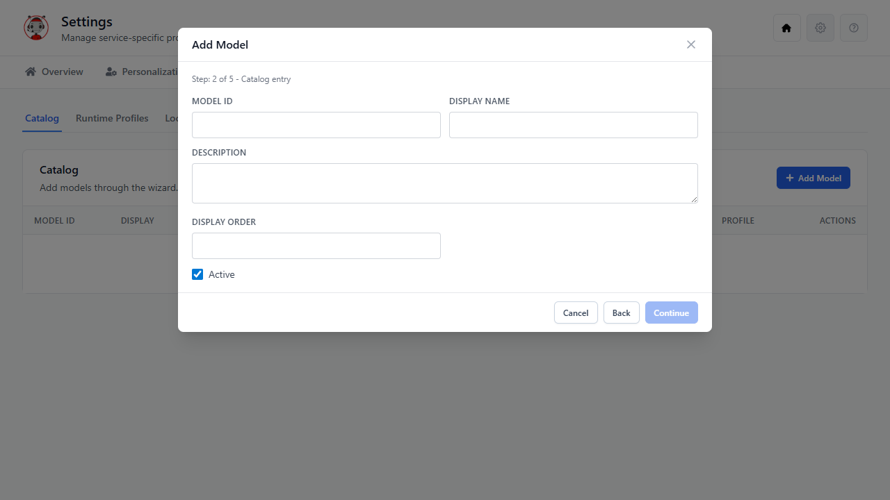

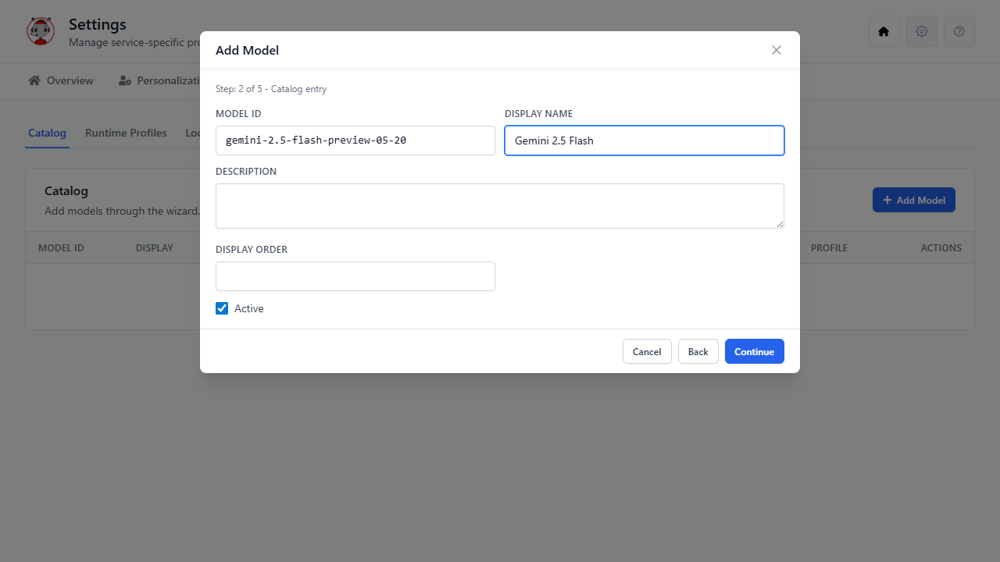

Click **Continue**.

### Step 3 — Provider Configuration

This step varies by provider. The top of every non-llama-cpp provider's step shows a **Runtime Profile** selector filtered to profiles that declare this provider.

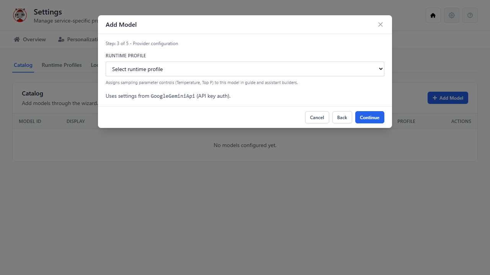

Only profiles whose **Providers** list includes the selected provider appear in the dropdown. For Google Gemini API the options are `google_gemini_25_flash` and `google_gemini_25_pro`.

> **Why two Gemini profiles?** Gemini 2.5 Flash supports disabling thinking (`none` budget), while 2.5 Pro requires thinking to always be on (minimum budget 128). Pick the profile that matches the model you are registering.

Select the appropriate profile:

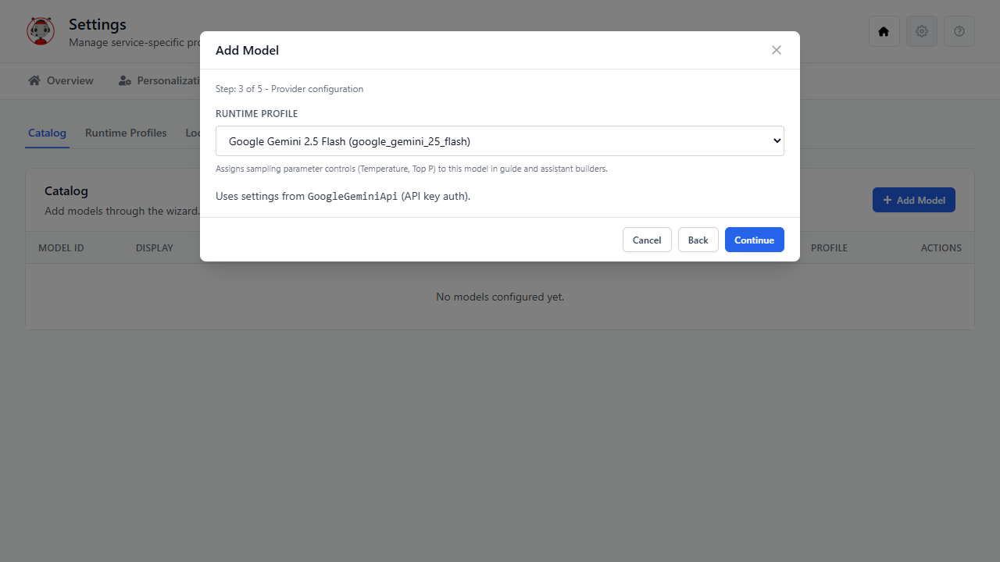

Provider-specific options (e.g. reasoning effort toggle for OpenAI Responses models, or thinking toggle for Anthropic) appear below the profile selector.

### Step 4 — Review and Create

Confirm the provider and model ID before submitting.

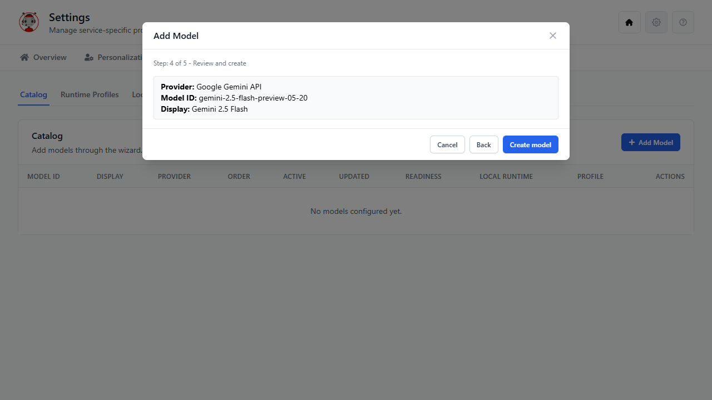

Click **Create model**. Cloud models are added synchronously and the wizard closes immediately.

### Step 5 — Result

The catalog now shows the new entry with its readiness state and assigned profile:

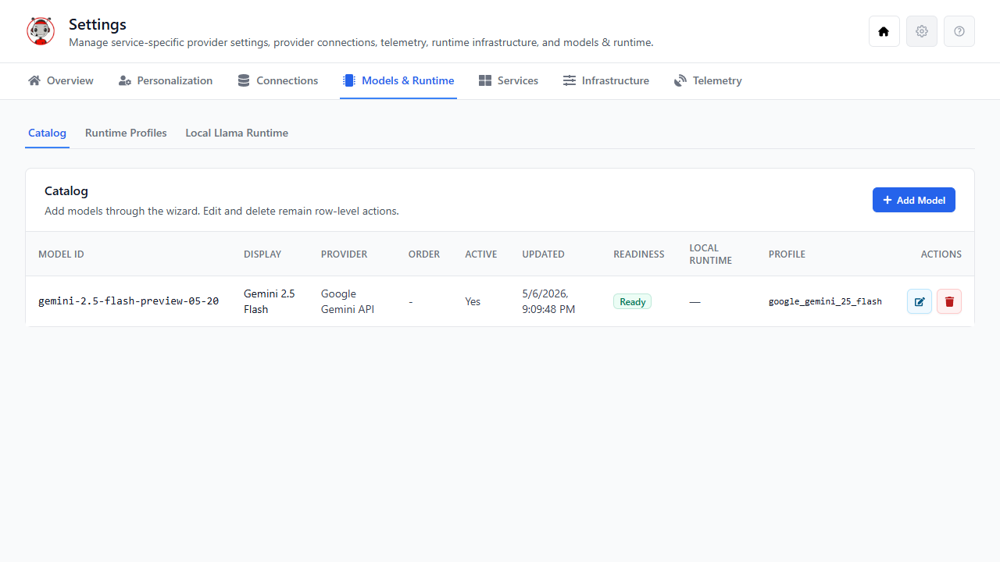

A **Ready** badge means the provider connection is healthy and the model ID was accepted. If the badge shows **Blocked**, check that the API key for the provider is configured under **Settings → Connections**.

---

## 4. Editing a Catalog Row

Click **Edit** on any catalog row to adjust display name, description, display order, active flag, or the assigned runtime profile.

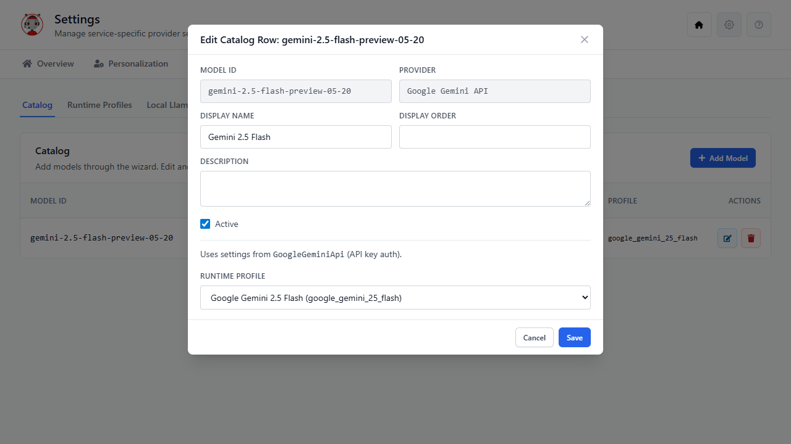

The **Runtime Profile** dropdown at the bottom of the modal shows only profiles whose `providers` array includes this model's provider — the same filtering logic as the wizard. Changing the profile takes effect immediately for all new conversations; in-flight conversations are not affected.

> **Reassigning a profile** is the primary way to change what sampling sliders and reasoning effort controls appear when this model is selected in a guide or assistant builder.

---

## 5. Tips and Troubleshooting

| Symptom | Cause | Fix |
|---|---|---|
| Runtime Profile dropdown shows "No profiles defined for `<provider>`" | No profile has that provider in its `providers` list | Edit an existing profile or create a new one and check the relevant provider checkboxes |
| Model shows "Blocked" readiness | Provider not connected or API key missing | Configure the connection under **Settings → Connections** |
| Temperature/Top P sliders missing in guide builder | Model has no profile assigned, or profile `samplingParametersJson` is empty | Assign a profile with at least one parameter with `exposedInGuideBuilder: true` |
| Reasoning effort dropdown missing in guide builder | Profile `thinkingControlJson` has no `choiceActions`, or model's reasoning choices are not set | Ensure the profile has a populated `thinkingControlJson` and the model has reasoning choices enabled in the provider config step |
