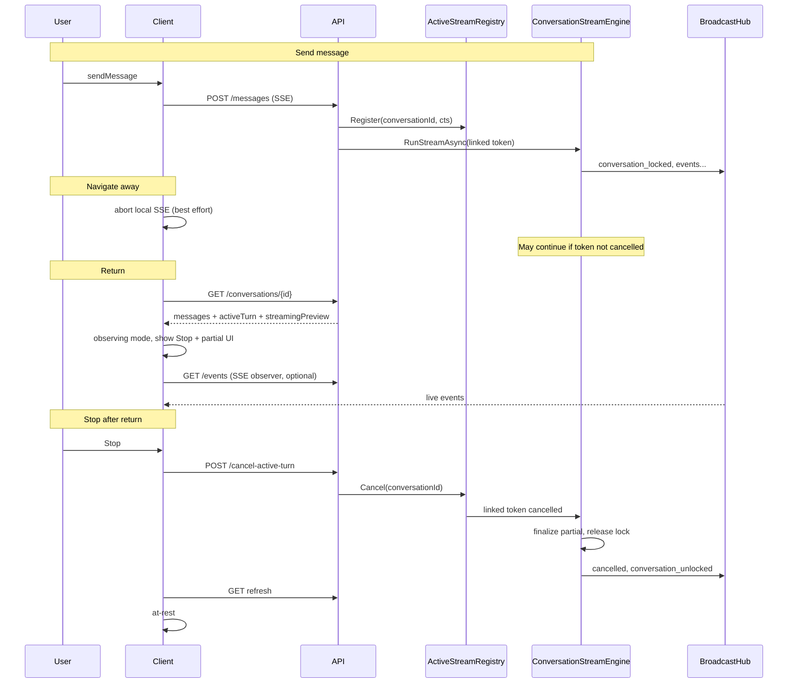

# Conversation Stream Reconnect and Server Cancel Proposal

Status: Proposal (ready for implementation)  
Last updated: 2026-07-12  
Owner: Conversation runtime / notebook UI  
Related:
- [Per-Assistant Tool Call Limits](./tool-call-limits-proposal.md) — complementary proposal to bound runaway tool loops (e.g. Search / ReadWeb)
- `src/client/src/contexts/ConversationContext.tsx`
- `src/client/src/contexts/conversation/useConversationActions.ts`
- `src/client/src/contexts/conversation/useStreamingEventHandler.ts`
- `src/client/src/components/notebook/conversations/ConversationHeader.tsx`
- `src/client/src/components/notebook/conversations/CellList.tsx`
- `src/server/GuideAntsApi/Services/Conversations/Streaming/ConversationStreamEngine.cs`
- `src/server/GuideAntsApi/Services/Conversations/ConversationBroadcastHub.cs`
- `src/server/GuideAntsApi/Services/Conversations/Queries/ConversationQueryService.cs`
- `src/server/GuideAntsApi/Services/Conversations/Persistence/ConversationPersistence.cs`
- `src/server/GuideAntsApi/Endpoints/NotebookConversationsEndpoints.cs`
- `src/server/GuideAntsApi.DataModel/Models/ConversationTurn.cs`
- `src/server/GuideAntsApi/Services/ReadWebTools.cs`

## 1. Problem Summary

When a user navigates away from a notebook conversation while a turn is still generating, then returns to the same conversation, the UI shows an **empty assistant cell** where the response will eventually appear. Worse, there is **no way to stop** the in-flight generation from the UI after return.

This was observed on long-running research turns (Creative Guide / Search assistant with many `ReadWeb` and `WebSearch` tool calls) where a single turn can run for many minutes, hold the conversation lock, and consume local LLM capacity — while the client presents an idle, read-only-looking thread.

The failure is not that the server stops working. The server continues streaming and persisting partial state. The failure is that **the client loses all knowledge that a turn is active** and has **no server-side cancel path** independent of the original SSE connection.

## 2. Observed Symptoms

From production-like local investigation (conversation `2149e46b-…`, Creative Guide, Qwen via llama-cpp):

| Symptom | Cause |
|---------|--------|
| User message visible, blank gap below | GET conversation excludes `IsStreaming=true` messages; client `isStreaming` is false |
| No Stop button in header | Stop renders only when `isStreaming &&` local `AbortController` exists |
| `cancelStream()` does nothing | Implementation only calls `currentStreamController.abort()` |
| Cannot send a new message | `ConversationLock` held until stream completes |
| Undo may fail with "busy" | Undo competes for the same distributed lock |
| Thread runs 20+ minutes with many ReadWeb calls | Search assistant retry instructions + repeated tool rounds; no per-assistant tool cap ([tool-call-limits-proposal.md](./tool-call-limits-proposal.md)) |

## 3. Root Cause Analysis

### 3.1 Client disconnects from server state on navigation

On conversation change or `ConversationProvider` unmount, the client:

1. Aborts the local SSE `AbortController`.
2. Clears messages and resets streaming state.
3. May call `COMPLETE_STREAMING_TURN` locally even though the server turn is still `streaming`.

On return, `refresh()` loads conversation messages from GET but:

- `isStreaming` remains `false`.
- `currentTurn` is `undefined`.
- No observer subscription is opened.

`CellList` only renders the live streaming turn when **both** `isStreaming` and `currentTurn` are set. The last grouped turn often has a persisted user message and maybe tool messages, but **no final assistant message** → empty gap.

### 3.2 GET API hides in-progress assistant content

`ConversationQueryService` filters streaming messages out of the normal message list:

```csharp
Messages = c.Messages.Where(m => m.IsStreaming != true) ...
```

The server **does** persist partial assistant text during streaming (`IsStreaming=true`, flushed periodically in `ConversationStreamEngine`). That content exists in SQL but is invisible to the reload API.

`NotebookConversationWithMessagesDto` also omits:

- `ConversationTurn.Status` (`streaming` / `completed` / `cancelled`)
- `ConversationTurn.LastUpdated` (indexed for observer polling)
- Active `ConversationLock` holder
- A streaming preview of partial assistant content

### 3.3 Observer infrastructure exists but is unwired

Already implemented but not connected on conversation mount:

| Piece | State |
|-------|--------|
| `streamingMode: 'observing'` | Reducer + event handler implemented |
| `setStreamingMode('observing')` | Implemented; **no production caller** |
| `ConversationBroadcastHub` | Broadcasts `conversation_locked`, `streaming_started`, `streaming_progress`, tool activity, `complete`, `conversation_unlocked` |
| `ConversationTurn.LastUpdated` | Updated during stream; index exists for polling |
| HTTP SSE subscribe endpoint for broadcast hub | **Missing** |
| Server-initiated cancel | **Missing** |

### 3.4 Cancel is client-local only

`ConversationHeader` shows Stop only when `isStreaming` is true. `cancelStream` only aborts `currentStreamController`.

Server cancellation today depends on **SSE disconnect** (`HttpContext.RequestAborted` → `ConversationStreamEngine` → `ThreadRun`). Problems:

1. **No explicit cancel API** — cannot stop from a returned client with no open SSE.
2. **Disconnect is not immediate** — background `Task.Run` + long nested tool/agent work may continue after client abort.
3. **Connection may persist** — if the tab stays open or the proxy keeps the socket alive, `RequestAborted` never fires.
4. **After return, cannot disconnect again** — no controller to abort.

Undo is not a substitute: it conflicts with the active stream lock.

### 3.5 ReadWeb and timeout context (why turns run so long)

Separate from reconnect, but relevant to urgency:

- `ReadWebTools`: 5s direct fetch timeout, 8s browser render timeout; failures return error text to the LLM (not stream cancellation).
- `ReadWeb` bridge calls `Agent.Invoke("Read Web", …)` — a **full nested agent** per URL, not a cheap HTTP fetch.
- Search assistant instructions require valid citations and **mandate retry** when citations are insufficient.
- Many sites return 403 → excluded-host list; agent tries alternate URLs in a loop.

Long turns are expected for this guide configuration. The UX must support **visibility** and **stop** for multi-minute runs.

## 4. Goals

1. On return to a conversation with an active server turn, immediately show intelligible in-progress UI (partial text, tool workflow, status banner) — not an empty cell.
2. Provide **Stop** that works after navigation away, without requiring an open SSE connection.
3. Reuse existing persistence (`ConversationTurn`, `IsStreaming` stubs, tool messages) and broadcast hub — no parallel state machine.
4. Support long-running tool-heavy turns (Search / ReadWeb) where assistant tokens arrive late or never before tools finish.
5. Release conversation lock promptly on cancel so the user can send again or undo.

## 5. Non-goals

1. **Resume as primary SSE client** — the original HTTP stream cannot be reattached; returning clients become observers.
2. **Include `IsStreaming` messages in the canonical message history array** without a dedicated preview boundary — risks duplicate/partial history rows.
3. **Change ReadWeb timeouts or Search retry policy** in this work (separate product decision).
4. **Multi-user presence UI** beyond showing who holds the lock / who is generating.
5. **Published wire API parity** in phase 1 (design registry at `ConversationStreamEngine` level so wire can follow).

## 6. Proposed Architecture

### 6.1 Overview



### 6.2 Server: active stream registry

Add singleton `IActiveConversationStreamRegistry`:

```csharp
interface IActiveConversationStreamRegistry
{
    IDisposable Register(Guid conversationId, CancellationTokenSource cts);
    bool TryCancel(Guid conversationId);
    bool IsActive(Guid conversationId);
}
```

**Registration** at start of `ConversationStreamEngine.RunStreamAsync` (before background run):

```text
linkedCts = CreateLinkedTokenSource(RequestAborted, registryCts)
pass linkedCts.Token to background run / ThreadRun
```

**Unregistration** in a `finally` block when the background run completes (completed, cancelled, or error).

This decouples cancellation from “is the original browser SSE socket still open.”

### 6.3 Server: `POST .../conversations/{convoId}/cancel-active-turn`

**Route:** `POST /api/projects/{projectId}/notebooks/{notebookId}/conversations/{convoId}/cancel-active-turn`

**Authorization:** `RequireContributor` (same as send).

**Behavior:**

1. Verify conversation exists and belongs to notebook.
2. If registry has active stream for `convoId` → call `TryCancel(convoId)`.
3. Else if latest turn `Status == 'streaming'` but no registry entry (orphan) → set turn `cancelled`, release lock, prune incomplete tool calls (recovery path).
4. Return:
   - `200 { turnIndex, status: "cancelled" }` when cancel was requested or recovery ran.
   - `204` or `200 { status: "idle" }` when nothing was active (idempotent).

**Existing cancel handling** in `ConversationStreamEngine` on `OperationCanceledException` already:

- Finalizes partial assistant message
- Prunes incomplete tool calls (`PruneIncompleteToolCallsAsync`)
- Sets turn `cancelled`
- Releases distributed lock
- Broadcasts `cancelled` via hub

No new terminal-state logic required — wire cancel into the same token path.

**Nested agents / ReadWeb:** cancellation must propagate through `ThreadRun` → `Agent.Invoke` → `ReadWebTools` via the linked token (already threaded today; verify under integration test).

### 6.4 Server: extend GET conversation response

Extend `NotebookConversationWithMessagesDto` (or add sibling `GET .../status`) with:

```json
{
  "activeTurn": {
    "turnIndex": 3,
    "status": "streaming",
    "assistantName": "Creative Guide",
    "lastUpdated": "2026-07-12T15:37:08Z",
    "startedAt": "2026-07-12T15:11:00Z"
  },
  "lock": {
    "lockedByUserName": "dougware",
    "acquiredAt": "..."
  },
  "streamingPreview": {
    "messageId": "...",
    "content": "partial assistant text so far...",
    "toolCallsJson": "...",
    "turnIndex": 3
  }
}
```

**Rules:**

- `activeTurn` derived from latest `ConversationTurn` row.
- `streamingPreview` populated only when `activeTurn.status === "streaming"`: read the current `IsStreaming=true` assistant stub for that turn (latest by `MessageSequence`).
- Keep `messages` array unchanged (no `IsStreaming` rows) to preserve history integrity.

**Optional lightweight poll:** `GET .../conversations/{convoId}/status` returning only `activeTurn`, `lock`, `streamingPreview` for 2–3s polling without full message hydration.

### 6.5 Server: observer SSE endpoint

**Route:** `GET .../conversations/{convoId}/events`  
**Header:** `Accept: text/event-stream`

Wrap `IConversationBroadcastHub.SubscribeToConversationAsync(conversationId, connectionId, ct)` and write SSE events using the same envelope as `POST /messages`.

**Authorization:** read access to notebook conversation (same project membership as GET conversation).

**Semantics:**

- Subscribe-only; does not acquire lock or start a new turn.
- Multiple subscribers allowed (tabs, collaborators).
- Initial event may be `connection_established` (already sent by hub).

Reject or no-op subscribe when turn is not active (optional: still allow subscribe briefly to catch `conversation_unlocked` race).

### 6.6 Client: hydrate on mount

In `ConversationContext` after `refresh()`:

**If `activeTurn?.status === 'streaming'`:**

1. `setStreamingMode('observing', { userId, userName: lock.lockedByUserName })`.
2. Build `currentTurn` from:
   - Tool messages in `messages` matching `activeTurn.turnIndex`
   - `streamingPreview.content` as streaming assistant cell (`streaming-{id}` placeholder)
   - `streamingPreview.toolCalls` if present
3. Set `isStreaming: true` (observing mode already does this via reducer).
4. Open observer SSE to `/events` and pipe through `useStreamingEventHandler`.
5. Show header Stop button.

**Stop button visibility:**

```text
isStreaming || activeTurn?.status === 'streaming'
```

(not only local SSE state)

### 6.7 Client: `cancelStream` dual path

```text
async function cancelStream() {
  if (currentStreamController) {
    // Active SSE client (user stayed on page)
    abort controller;
  } else if (activeTurnFromServer?.status === 'streaming') {
    // Returned after navigation — server cancel
    await api.conversations.cancelActiveTurn(projectId, notebookId, conversationId);
    // await cancelled event on observer SSE or poll until status !== streaming
    refresh();
    completeStreamingTurn locally;
  }
}
```

Always show loading state (`isCancelling`) during server cancel.

### 6.8 Client: unmount behavior fix

On `ConversationProvider` unmount or conversation switch:

- **Do** abort local SSE controller (best-effort disconnect).
- **Do not** call `COMPLETE_STREAMING_TURN` if server `activeTurn.status === 'streaming'` (avoid pretending the turn finished locally).
- Clear local ephemeral state only.

On remount, hydration reconstructs from server.

### 6.9 UI expectations after fix

| State | User sees |
|-------|-----------|
| Returned mid-stream, tools only | Workflow section with ReadWeb / Search activity; optional “Research in progress…” banner |
| Returned mid-stream, partial text | Streaming assistant cell with flushed content; workflow above if tools ran |
| Stop clicked after return | “Stopping…” → turn finalized or pruned → draft input re-enabled |
| Turn completes while observing | `complete` event → full refresh → at-rest |

## 7. Implementation Phases

### Phase A — Server cancel (highest urgency)

Unblocks runaway turns and lock release without any UI beyond a raw API call.

1. `IActiveConversationStreamRegistry` + DI registration.
2. Wire registry into `ConversationStreamEngine.RunStreamAsync`.
3. `POST /cancel-active-turn` endpoint.
4. Integration tests: cancel during LLM stream; cancel during ReadWeb tool; cancel idempotent when idle; lock released.

### Phase B — Visibility on return (polling)

Fixes empty cell without requiring SSE observer yet.

1. Extend GET conversation (or `/status`) with `activeTurn`, `lock`, `streamingPreview`.
2. Client hydrate + observing mode on mount.
3. Poll `/status` every 2–3s on `lastUpdated` change while `streaming`.
4. Client `cancelStream` server path + Stop button when `activeTurn.streaming`.

### Phase C — Live observer SSE

1. `GET /events` endpoint.
2. Client subscribes on hydrate; replace polling for live tokens/tool activity.
3. Reuse `useStreamingEventHandler` unchanged for event types.

### Phase D — Polish

1. Conversation list indicator for in-flight turns (spinner on sidebar row).
2. Elapsed time / “Research in progress” copy for tool-heavy guides.
3. Published conversation parity if `ConversationStreamEngine` is shared.
4. Orphan recovery hardening (registry miss + DB `streaming` turn).

## 8. API Summary

| Method | Path | Purpose |
|--------|------|---------|
| `GET` | `.../conversations/{id}` | Extended with `activeTurn`, `lock`, `streamingPreview` |
| `GET` | `.../conversations/{id}/status` | Optional lightweight poll target |
| `GET` | `.../conversations/{id}/events` | SSE observer (broadcast hub) |
| `POST` | `.../conversations/{id}/cancel-active-turn` | Server-initiated cancel |
| `POST` | `.../conversations/{id}/messages` | Unchanged (primary stream client) |

## 9. Testing Plan

### 9.1 Server integration tests

- Start stream, disconnect SSE client, call `cancel-active-turn` → turn `cancelled`, lock released.
- Start stream, call `cancel-active-turn` while connected → same outcome via registry token.
- Cancel during active ReadWeb fetch → tool aborts, turn cancels.
- GET during streaming returns `streamingPreview` matching persisted stub content.
- Observer receives `assistant_message`, `tool_result`, `complete` events via hub.

### 9.2 Client tests

- Mock GET with `activeTurn.status=streaming` → `isStreaming` true, Stop visible, `currentTurn` created.
- `cancelStream` without controller → calls cancel API.
- Unmount during stream without `COMPLETE_STREAMING_TURN` when server still streaming.
- Observer SSE events update workflow and streaming cell.

### 9.3 Manual acceptance

1. Send research prompt on Creative Guide; navigate to another notebook page; return → see workflow and/or partial text, not empty cell.
2. Click Stop after return → generation stops, lock clears, can send new message.
3. Leave tab open on conversation; open same conversation in second tab → observer sees live updates; Stop from either tab works.
4. Let turn complete while away → return shows completed message after refresh.

## 10. Decisions

| Decision | Choice | Rationale |
|----------|--------|-----------|
| Reattach original SSE | No | HTTP stream not resumable; observe instead |
| Streaming messages in `messages[]` | No | Use `streamingPreview`; keep history clean |
| Cancel mechanism | Registry + explicit POST | Disconnect alone is unreliable |
| Stop visibility | Server `activeTurn` OR local `isStreaming` | Works after navigation |
| Observer transport | SSE via broadcast hub | Already emits all needed event types |
| Phase order | Cancel before/full parallel with visibility | Stop runaway work first |
| Undo as cancel | No | Different semantics; lock conflict |

## 11. Open Questions

1. **Cancel authorization** — any contributor on the notebook, or only lock holder? Recommendation: any contributor for OSS single-user; stricter for multi-tenant later.
2. **Polling vs SSE default** — ship polling in Phase B, SSE in Phase C; keep polling as fallback when EventSource fails.
3. **Published conversations** — same endpoints under published routes, or notebook-only in v1? Registry at engine level makes parity straightforward.
4. **Search retry policy** — instruction changes out of scope here; per-assistant tool call limits are covered in [tool-call-limits-proposal.md](./tool-call-limits-proposal.md).

## 12. Success Criteria

- [ ] Returning to a streaming conversation never shows an empty assistant gap when server has partial state or tool progress.
- [ ] Stop is always available while `ConversationTurn.Status == streaming'`, regardless of client SSE connection.
- [ ] Cancel stops nested agent / ReadWeb work within bounded time and releases lock.
- [ ] Completed turn after observe path matches message history as if user had stayed on page.
- [ ] No duplicate assistant messages in persisted history from preview/hydrate logic.
