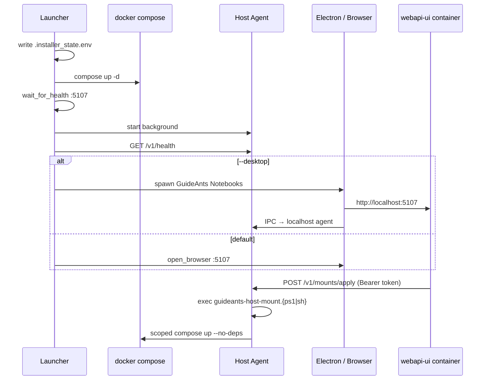
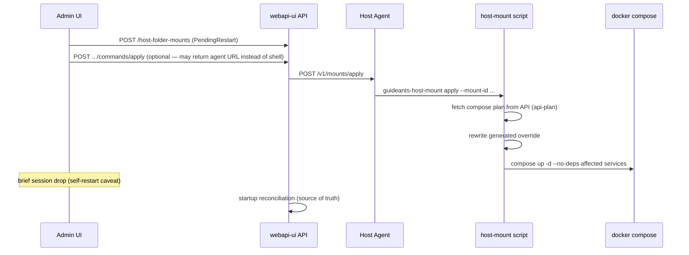

# Host Agent and Desktop Runtime Proposal

Last updated: 2026-07-12

This document is the canonical design for a **cross-platform host-side actuator**
that containers and the GuideAnts desktop app can call to update Compose stack
configuration (generated overrides, env, scoped service restarts). It extends the
shipped host-folder mount helpers with automatic apply/remove and optional
Electron integration.

**Status:** Proposal — not yet implemented. The manual host-mount flow documented
in [`host-folder-mounts.md`](./host-folder-mounts.md) remains the current operator
path.

**Related:**

- Shipped mount feature: [`host-folder-mounts.md`](./host-folder-mounts.md),
  [`host-folder-notebook-mounts-plan.md`](./host-folder-notebook-mounts-plan.md)
- Implementation tracking: [`host-agent-execution/STATUS.md`](./host-agent-execution/STATUS.md)
- Portable launcher: [`../installer/README.md`](../installer/README.md)
- Electron app: `src/client/electron/` (`GuideAnts Notebooks`)

---

## 1. Problem

Several admin operations require **host filesystem access** and **`docker compose`**
on the machine where the engine runs:

- Adding or removing host-folder bind mounts (`docker-compose.host-mounts.generated.yml`)
- Regenerating ROCm runtime overrides (`docker-compose.rocm-runtime.generated.yml`)
- Future: env merges, backend switches, scoped service restarts

A container **cannot** safely perform these actions on its own. Today the admin
copies a PowerShell or shell command from the UI and runs it on the host
(`guideants-host-mount.ps1` / `.sh` under `installer/scripts/`).

We want:

1. **One-click apply** from the UI (container or Electron) without shell copy-paste.
2. **Windows, Linux, and macOS** support, including WSL2 on Windows.
3. **Optional Electron desktop** launched alongside the stack, with IPC to the same
   host actuator.
4. **No Docker socket** in application containers (security).

---

## 2. Architecture

Three roles, intentionally separate:

| Role | Process | Lifetime |
|------|---------|----------|
| **Orchestrator** | `guideants.cmd` / `guideants.sh` | Start/stop session |
| **Host agent** | `guideants-host-agent.mjs` (localhost HTTP) | Runs while stack is up |
| **Desktop UI** | Electron or browser | User-facing; may close independently |



### 2.1 Why not put the agent inside Electron main?

Electron already embeds `express` for static file serving (`src/client/electron/main.mjs`),
but the host agent should **not** live only in Electron because:

1. **Self-restart** — mount apply restarts `guideants-webapi-ui`. The actuator must
   survive that bounce.
2. **Window lifecycle** — on Windows/Linux, Electron quits when all windows close
   (`window-all-closed` → `app.quit()`). That would kill in-process host operations.
3. **Headless installs** — browser-only users may never install Electron.

**Electron is a client of the host agent**, not a replacement for it.

### 2.2 Why not mount `docker.sock` into the API container?

Mounting the Docker socket gives the container **root-equivalent host control**.
Reject for `guideants-webapi-ui` and sibling app containers. The host agent runs
on the host and executes only **allowlisted** operations via existing helper scripts.

---

## 3. Host agent design

### 3.1 Implementation

Single cross-platform **Node** script:

```text
installer/scripts/guideants-host-agent.mjs
```

It is a thin HTTP wrapper that **execs** the existing platform helpers (no
duplicate compose logic):

| Platform | Mount / compose helper |
|----------|------------------------|
| Windows (native PowerShell) | `installer/scripts/guideants-host-mount.ps1` |
| Linux / macOS / WSL | `installer/scripts/guideants-host-mount.sh` |

The agent detects environment the same way as `guideants.sh` / `guideants.cmd`
(`OS`, `IS_WSL`, presence of `pwsh` vs `bash`).

Future compose operations (ROCm override regen, env reload) add routes that spawn
the corresponding existing scripts (`rocm-runtime-compose.ps1`, etc.) rather than
inlining shell in the agent.

### 3.2 Listen address and discovery

- Bind **`127.0.0.1` only** — never `0.0.0.0`.
- Choose a free port at startup (same pattern as Electron `findAvailablePort` in
  `main.mjs`).
- Persist to `.installer_state.env`:

```text
HOST_AGENT_PORT=17421
HOST_AGENT_TOKEN=<random-256-bit-hex>
HOST_AGENT_URL=http://127.0.0.1:17421
HOST_AGENT_PID=12345
```

- Inject into the API container via compose env (double-underscore .NET convention):

```text
GuideAntsRuntime__HostAgentUrl=http://host.docker.internal:17421
GuideAntsRuntime__HostAgentToken=<same-token>
```

- **Linux compose** must include:

```yaml
extra_hosts:
  - "host.docker.internal:host-gateway"
```

Windows Docker Desktop and macOS resolve `host.docker.internal` without this.

### 3.3 HTTP API (v1)

All mutating routes require `Authorization: Bearer <HOST_AGENT_TOKEN>`.

| Method | Path | Body | Action |
|--------|------|------|--------|
| `GET` | `/v1/health` | — | `{ ok, platform, composeFile, agentVersion, pid }` |
| `POST` | `/v1/mounts/apply` | `{ mountId, hostPath?, projectId? }` | Exec `guideants-host-mount apply` |
| `POST` | `/v1/mounts/remove` | `{ mountId, projectId? }` | Exec `guideants-host-mount remove` |
| `POST` | `/v1/compose/reload` | `{ services?: string[] }` | Scoped `compose up -d --no-deps` (future) |

**Response shape (apply/remove):**

```json
{
  "success": true,
  "exitCode": 0,
  "stdout": "...",
  "stderr": "...",
  "restartedServices": ["guideants-webapi-ui", "guideants-ai", "plantuml"]
}
```

**Errors:** `401` bad token, `409` operation already running (single-flight lock),
`422` validation failure, `500` script non-zero exit (include stderr).

**Single-flight:** only one mutating operation at a time (mutex file under
`installer/.guideants/` or in-memory lock). Concurrent apply requests queue or
return `409`.

### 3.4 Security

- Token generated on first launcher run; file mode `600` on Unix for
  `.installer_state.env`.
- Agent validates `mountId` as UUID; `hostPath` must be absolute and pass the same
  rules as the API mount validator (no `..`, no control chars).
- No generic `/exec` or shell passthrough endpoint.
- Logs redact token and sanitize paths (`LogValueSanitizer` parity with API).

---

## 4. Launcher integration

Extend `installer/scripts/guideants-launcher.ps1` (via `guideants.cmd`) and `installer/guideants.sh` after health check:

1. Start host agent if not already running (pidfile + health probe).
2. Write agent port/token/pid into `.installer_state.env`.
3. Launch UI (browser or Electron).

**New flags (proposed):**

| Flag | Behavior |
|------|----------|
| `--desktop` | Launch packaged Electron instead of default browser |
| `--no-desktop` | Force browser even when Electron binary is present |
| `--agent-only` | Start stack + agent; no UI (automation/CI) |
| `--no-agent` | Skip agent (current manual-command-only behavior) |

**Stop path** (`stop_guideants.cmd` / `stop_guideants.sh`):

1. Stop host agent gracefully (`SIGTERM`, then `SIGKILL` after timeout).
2. `docker compose down` as today.

### 4.1 WSL rule

The agent must run in the **same environment as `docker compose`**:

- Docker Desktop with WSL2 backend → agent inside the WSL distro the launcher uses.
- Native Windows Docker → PowerShell agent + `.ps1` helpers.
- Never mix: a Windows-native agent cannot run `docker compose` that targets the
  WSL engine unless paths and context align.

This matches existing launcher detection (`IS_WSL`, `OsName` in `guideants-launcher.ps1`).

### 4.2 Platform background start

| Platform | Start mechanism |
|----------|-----------------|
| Windows (PS) | `Start-Process -WindowStyle Hidden node ...` |
| Linux / macOS | `nohup node ... &` + pidfile |
| WSL | Same as Linux inside WSL |

Optional later: `launchd` (macOS) or Windows service for login-item autostart — out
of scope for phase 1.

---

## 5. Electron integration

### 5.1 Recommended startup: launcher starts both

```text
guideants.cmd --desktop
  ├─ docker compose up
  ├─ guideants-host-agent.mjs (background)
  └─ GuideAnts Notebooks.exe / GuideAnts.app / AppImage
```

Electron loads **`http://localhost:5107`** (the container UI), not only its bundled
static server — the desktop app is a native shell around the running stack.

**Install layout (proposed):**

```text
installer/
├── guideants.cmd
├── guideants.sh
├── GuideAnts/
│   ├── GuideAnts.exe              # Windows
│   ├── GuideAnts.app/             # macOS
│   └── guideants-notebooks        # Linux AppImage or binary
└── scripts/
    ├── guideants-launcher.ps1
    ├── guideants-host-agent.mjs
    ├── guideants-host-mount.ps1
    └── guideants-host-mount.sh
```

Launcher sets `GUIDEANTS_INSTALL_ROOT` so Electron finds `.installer_state.env`.

### 5.2 Fallback: Electron opened directly

If the user double-clicks Electron without running the launcher:

1. Read `GUIDEANTS_INSTALL_ROOT` or search upward for `.installer_state.env`.
2. `GET /v1/health` on recorded port; if stack healthy, open `localhost:5107`.
3. If stack missing, show setup UI that shells out to `guideants.cmd` / `guideants.sh` (or instruct
   the user to run the launcher first).

Electron **may** ensure the agent is running on startup, but must not duplicate full
launcher logic (backend selection, image pull, ROCm staging).

### 5.3 Preload / IPC (proposed)

Extend `src/client/electron/preload.mjs`:

```typescript
window.electron.hostAgent.applyMount({ mountId, hostPath? })
window.electron.hostAgent.removeMount({ mountId })
window.electron.hostAgent.health()
```

Main process forwards to `http://127.0.0.1:${HOST_AGENT_PORT}` with token from
`.installer_state.env`. Renderer never holds the token in persistent storage.

Both **Electron IPC** and **container HTTP → host.docker.internal** hit the same
agent and the same helper scripts.

---

## 6. State file contract

Extend `.installer_state.env` (written by launcher; read by agent, helpers, Electron):

```text
# Existing (shipped)
BACKEND=cpu
COMPOSE_MODE=ghcr
COMPOSE_FILE=docker-compose.ghcr-cpu.yml
HOST_MOUNT_OVERRIDE_FILE=docker-compose.host-mounts.generated.yml
DOCKER_DIRECTORY=docker
START_COMMAND=guideants.cmd
LAST_RUN_EPOCH=...

# Proposed (host agent)
HOST_AGENT_PORT=17421
HOST_AGENT_TOKEN=...
HOST_AGENT_URL=http://127.0.0.1:17421
HOST_AGENT_PID=12345
UI_MODE=electron|browser
ELECTRON_PATH=GuideAnts/GuideAnts.exe
API_BASE=http://localhost:5107
```

Extend `GuideAntsRuntime__*` on `guideants-webapi-ui`:

```text
GuideAntsRuntime__HostAgentUrl=http://host.docker.internal:17421
GuideAntsRuntime__HostAgentToken=<token>
```

Existing vars (`GuideAntsRuntime__ComposeFile`, `__HostMountOverrideFile`, etc.)
stay unchanged — see [`host-folder-notebook-mounts-plan.md` §5](./host-folder-notebook-mounts-plan.md).

---

## 7. End-to-end mount apply (with agent)



The **self-restart caveat** from host mounts still applies: `guideants-webapi-ui` is
in the affected-services set. Startup reconciliation remains authoritative; post-apply
API callbacks are best-effort.

When the agent is **unavailable**, the UI falls back to displaying the manual shell
command (current behavior).

---

## 8. Scope beyond host mounts

The same agent pattern applies to other host-side compose mutations already scripted
in the installer:

| Operation | Existing script | Agent route (future) |
|-----------|-----------------|----------------------|
| Host folder mount apply/remove | `guideants-host-mount.*` | `/v1/mounts/*` (phase 1) |
| ROCm WSL runtime override | `rocm-runtime-compose.*` | `/v1/compose/rocm-regen` |
| Full stack stop | `stop_guideants.*` | not exposed to containers |
| Backend reconfigure | launcher `--reconfigure` | admin-only, not container-triggered |

Container-triggered routes remain **narrow** — mounts and scoped reloads only.

---

## 9. Phased implementation

| Phase | Deliverable | User-visible change |
|-------|-------------|---------------------|
| **1** | `guideants-host-agent.mjs`; launcher start/stop; compose env vars; API client in webapi-ui | One-click apply in browser admin UI |
| **2** | `--desktop` flag; Electron loads `:5107`; preload IPC to agent | Native app + in-app apply |
| **3** | Bundle Electron in installer; health tray optional; docs/runbook | Single-download desktop install |

Track progress in [`host-agent-execution/STATUS.md`](./host-agent-execution/STATUS.md).

---

## 10. Testing and gates

- **Unit:** agent route validation, token auth, single-flight lock.
- **Integration:** agent execs real helper against temp compose dir + mock API plan.
- **E2E:** launcher starts agent → container calls apply → override file updated →
  scoped restart (docker gate).
- **Security:** token required; no docker.sock in API container; path injection cases.
- **Cross-platform matrix:** Windows native PS, WSL, Linux, macOS (Docker Desktop).

Reuse [`host-mounts-execution/docker-gate.md`](./host-mounts-execution/docker-gate.md)
patterns for compose validation and scoped restart.

---

## 11. Open questions

Record resolutions in [`host-agent-execution/DECISIONS.md`](./host-agent-execution/DECISIONS.md).

| # | Question | Default proposal |
|---|----------|------------------|
| D1 | Fixed port vs dynamic? | Dynamic + persist in `.installer_state.env` |
| D2 | Agent in repo `docker/` vs `installer/scripts/`? | `installer/scripts/` (portable bundle) |
| D3 | Container calls agent directly or only via API proxy? | API proxies (token stays off browser); Electron may call agent directly via IPC |
| D4 | Bundle Node with agent or require system Node? | Ship Node with Electron installer; fallback to `node` on PATH for dev |
| D5 | macOS agent autostart at login? | Defer to phase 3 |

---

## 12. Related documents

| Document | Purpose |
|----------|---------|
| [`host-folder-mounts.md`](./host-folder-mounts.md) | Shipped operator runbook (manual commands) |
| [`host-folder-notebook-mounts-plan.md`](./host-folder-notebook-mounts-plan.md) | Original mount architecture |
| [`host-agent-execution/00-orchestration.md`](./host-agent-execution/00-orchestration.md) | Implementation dispatch order |
| [`host-agent-execution/DECISIONS.md`](./host-agent-execution/DECISIONS.md) | Locked design choices |
| [`host-agent-execution/STATUS.md`](./host-agent-execution/STATUS.md) | Phase ledger |
| [`../installer/README.md`](../installer/README.md) | Portable launcher usage |
