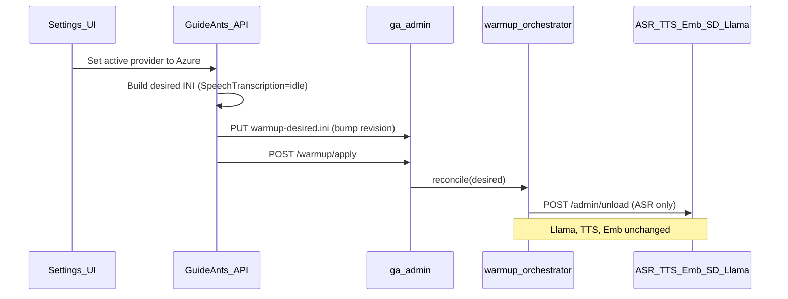

# INI-driven local AI warmup orchestration

## What "stop" means (clarified)

There is **no separate emergency stop/cancel signal**. The only control surface is:

1. **API writes desired state** to `/models-local/warmup-desired.ini` (on the `ai_local_models` volume, via ga-admin HTTP — same pattern as [`router-models.ini`](../../docker/build/guideants-ai/llama-admin-service/llama_router_ini.py)).
2. **API signals apply** (`POST /warmup/apply`) so the AI container reconciles **to that file**.

When a user switches a service to a **non-local provider** (e.g. ASR → Azure), the API updates that service's section to `desired = idle` and applies. The orchestrator **unloads only that service** — it does **not** unload/reload llama or other still-local services. This directly fixes the SEV A1 failure mode where `WarmupAllAsync` nuked all aux services because llama burped.



## Architecture

| Layer | Responsibility |
|-------|----------------|
| **API** | Resolve desired state from `ServiceModes` + `ChatDefaults` (existing D11 rules). Write INI. Signal apply. Expose status to UI. **Never** call per-engine `/admin/load` or `/admin/unload`. |
| **ga-admin** | Atomic INI I/O, apply endpoint, status endpoint, host the orchestrator thread. |
| **warmup_orchestrator** | Single executor: read desired INI, diff against applied state, run minimal transitions in D11 order. |
| **Data-plane engines** | Unchanged load/unload/warmup behavior (`asr_service.py`, etc.). |

### Persisted files (on `ai_local_models` volume)

| File | Writer | Reader |
|------|--------|--------|
| `/models-local/warmup-desired.ini` | API (via ga-admin) | orchestrator |
| `/models-local/.warmup-state.json` | orchestrator | orchestrator + `GET /warmup/status` |

Mirror the revision pattern from [`fleet_projection.py`](../../docker/build/guideants-ai/llama-admin-service/fleet_projection.py): `desiredRevision`, `appliedRevision`, `applyStatus`, per-service phase.

### INI shape (draft)

```ini
version = 1
revision = 42
updated_at_utc = 2026-07-12T19:00:00Z

[llama]
desired = warm          ; warm | idle
router_alias = Qwen3.6-35B-A3B-MTP-GGUF

[SpeechTranscription]
desired = warm          ; warm | idle
model_id = qwen3_asr_0_6b

[Embeddings]
desired = warm
model_id = qwen3_embedding_0_6b

[SpeechSynthesis]
desired = warm
model_id = chatterbox

[ImageGeneration]
desired = warm
bundle_id = flux2-klein-4b-q4ks
```

Load order is **not** in the INI — hardcoded in orchestrator per D11:
- **Unload (when needed):** ImageGeneration → SpeechSynthesis → Embeddings → SpeechTranscription
- **Load (when needed):** SpeechTranscription → Embeddings → SpeechSynthesis → ImageGeneration
- **Llama:** reconcile between aux unload and aux load (only when `[llama]` desired state changed or aux unload requires GPU drain)

### Idempotency (requirement 4)

On `POST /warmup/apply`:
- If `desiredRevision == appliedRevision` → **200 noop**
- If `desiredRevision == inProgressRevision` and INI hash unchanged → **200 continue** (do not restart)
- If `desiredRevision` changed while in progress → finish current atomic step, re-read INI, continue toward new desired (no full restart from step 1 unless llama section changed)

### Incremental reconcile (fixes SEV A1)

Orchestrator diffs desired vs applied **per service**:
- `warm → idle`: unload that service only
- `idle → warm`: load that service (after any required llama GPU drain if policy says so)
- `warm → warm` with different `model_id`: load new model (supersedes old for single-model engines)
- **No global "unload all aux"** unless llama desired state change requires GPU drain (e.g. loading a new default llama alias)

## API changes (.NET)

### New (replace orchestration logic)

- `LocalAiDesiredStateBuilder.cs` — maps `ServiceModeResolver` + `ChatDefaults:DefaultModelId` → INI document (reuses routing rules from today's `ResolveLocalRoutingDesiredStateAsync`).
- `LocalAiWarmupOrchestrationClient.cs` — `PutDesiredAsync(ini)`, `ApplyAsync()`, `GetStatusAsync()` → ga-admin HTTP.
- Narrow `ILocalAiStartupWarmupService` → **`ILocalAiWarmupService`** with only: `SyncDesiredAndApplyAsync()`, `GetStatusAsync()`, `IsApplyInProgress`.

### Call sites (all become write-ini + apply)

| Today | After |
|-------|-------|
| `Program.cs` `WarmupAllAsync` on startup | `SyncDesiredAndApplyAsync` |
| `LocalAiRuntimeWatchdogHostedService` full `WarmupAllAsync` | Compare desired vs container status; if drift, rewrite INI + apply (debounced, no 502-triggered nuclear cycle) |
| `SettingsServiceEditorEndpoints` provider change | Update INI + apply |
| `SettingsServiceLocalModelsEndpoints` load/unload/select-active | Update INI model ref + apply |
| `SettingsLlamaEndpoints` runtime load aux dance | Update `[llama]` section + apply |
| `NotebookModelRuntimeService` direct llama load + `EnsureAuxiliaryServicesLoadedAsync` | Update `[llama].router_alias` + apply; poll status |
| `SettingsCoreEndpoints` manual warmup | `SyncDesiredAndApplyAsync` |

### Delete / remove

- Bulk of `LocalAiStartupWarmupService.cs` (~HTTP load/unload/poll loops) — **delete**, not leave dead.
- Duplicate `IsRouterModelLoaded` helpers — consolidate into one shared module or rely on orchestrator status.
- Unused `LlamaRouterIniSyncService` if still unwired after pass.
- Retire `GA_*_AUTO_LOAD_ON_STARTUP` references in docs/compose comments (already non-functional).

## Container changes (Python)

### New module

- `warmup_desired_ini.py` — parse/write atomic INI (mirror `llama_router_ini.py` locking).
- `warmup_orchestrator.py` — background reconciler:
  - Calls localhost engine admin APIs (same URLs ga-admin already proxies)
  - Llama via existing llama-server load/unload or `signal_llama_server_reload` when alias set changes
  - Writes `.warmup-state.json`
  - Enforces D11 order only across services whose desired state **changed**

### ga-admin routes

Add to `ga_admin_service.py`:

- `PUT /warmup/desired` — atomic INI write, bump revision
- `POST /warmup/apply` — kick reconciler (idempotent per rules above)
- `GET /warmup/status` — revision, phase, per-service applied/desired, errors (replaces scattered `/ready` polling from API)

Expose via nginx at `/llama-admin/warmup/*` (no new nginx prefix needed).

### Container startup

In `entrypoint.sh` or ga-admin `on_startup`:
- After processes are up, if `desiredRevision > appliedRevision` → auto-apply once.
- Remove/ignore `GA_*_WAIT_FOR_READY_ON_STARTUP` monitors as orchestration authority (optional: keep as debug-only logs).

## UI / readiness

- Settings runtime panels (`AsrModelManager.tsx`, etc.) continue polling `runtime-readiness` but backend should source from **`GET /warmup/status`** + engine `/ready`, not config-only green badge.
- `RoutingReadinessService`: for local providers, add blocker when orchestrator reports service `desired=warm` but `applied≠warm`.

## Tests

| Area | Coverage |
|------|----------|
| Python | INI round-trip, idempotent apply, incremental idle for one service, D11 order when multiple services change, revision continue-not-restart |
| C# | `LocalAiDesiredStateBuilder` from ServiceModes fixtures, client contract tests |
| Regression | Port key cases from `LocalAiStartupWarmupServiceTests.cs` to new model |

## Rollout

1. Ship container orchestrator + ga-admin endpoints (orchestrator can run alongside old API path behind feature flag if needed).
2. Switch API call sites to INI+apply; delete old warmup service code.
3. Replace watchdog with debounced drift sync.
4. Rebuild `guideants-ai` image; verify on cuda stack that provider switch to Azure unloads ASR only and llama 502 no longer cold-starts TTS for 17 minutes.

## Non-goals

- Changing inference APIs or engine load/warmup semantics inside `asr_service.py` / `tts_service.py`.
- Notebook-global routing override (D11 still applies for aux).
- Mounting `ai_local_models` into `guideants-webapi-ui` (INI stays volume-local; API writes via HTTP).
