# Local AI Setup Guide

This guide walks through configuring GuideAnts to use locally-hosted AI models for chat, speech transcription (ASR), text-to-speech (TTS), image generation, and embeddings.

## Prerequisites

Before starting, ensure:

1. **Docker infrastructure is running** — the `guideants-ai` container stack must be up (provides llama-cpp, ASR, TTS, SD, and embeddings engines).
2. **Hugging Face token** — a valid HF token is required to download models. Set it up on the Settings → Connections → Hugging Face section before running the wizard.
3. **GuideAnts is running** — the web application is accessible (default: `http://localhost:5107/`).

## Step 1: Open the Add AI Services Wizard

From the home page, click **Setup Wizard** in the top navigation bar.

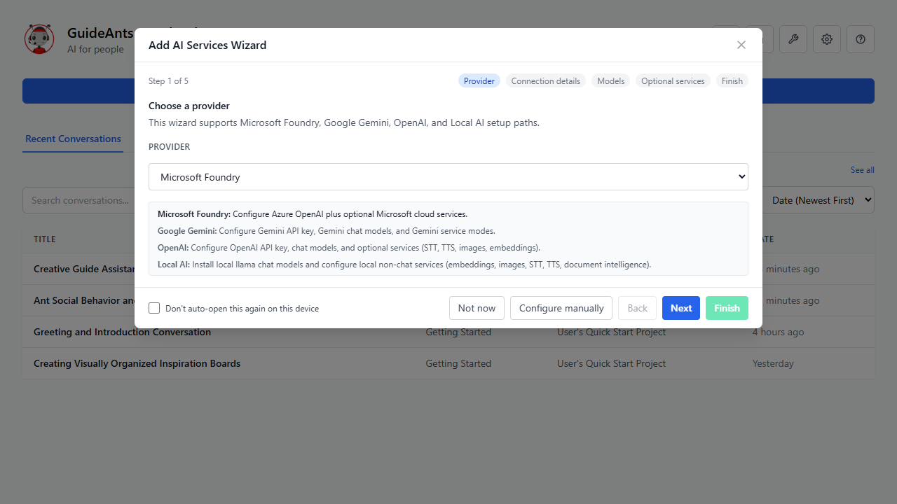

## Step 2: Select Local AI Provider

In the wizard's first step, select **Local AI** from the provider dropdown, then click **Next**.

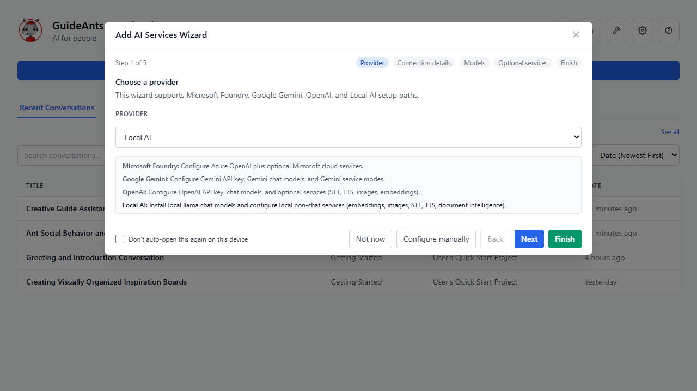

The Local AI path handles:
- Local llama-cpp chat models (GGUF format via Hugging Face)
- Local non-chat services (ASR, TTS, Images, Embeddings)

## Step 3: Verify Prerequisites

The wizard verifies that:
- A Hugging Face token is saved
- The local AI infrastructure containers are reachable

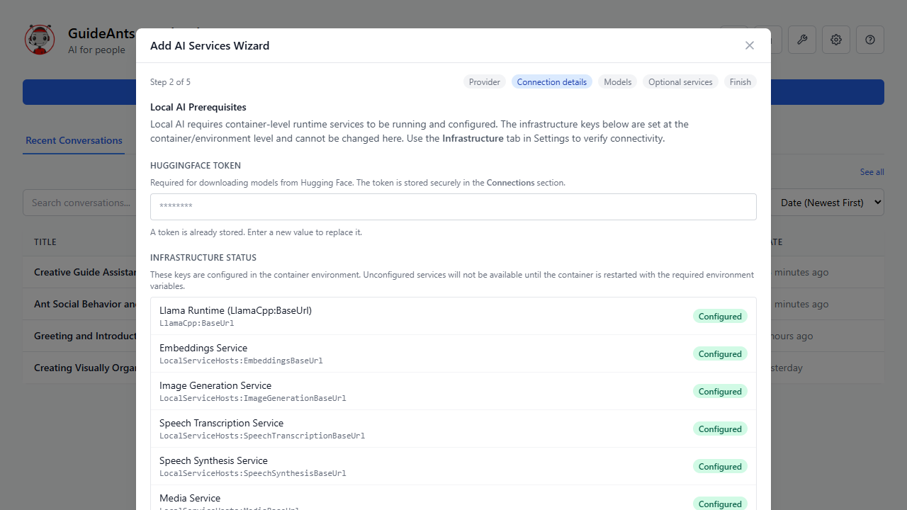

Both checks must pass (green) before you can proceed. If the HF token is missing, navigate to Settings → Connections → Hugging Face to add it.

## Step 4: Add a Chat Model

The Model step lets you browse and download a GGUF model from Hugging Face for local chat inference.

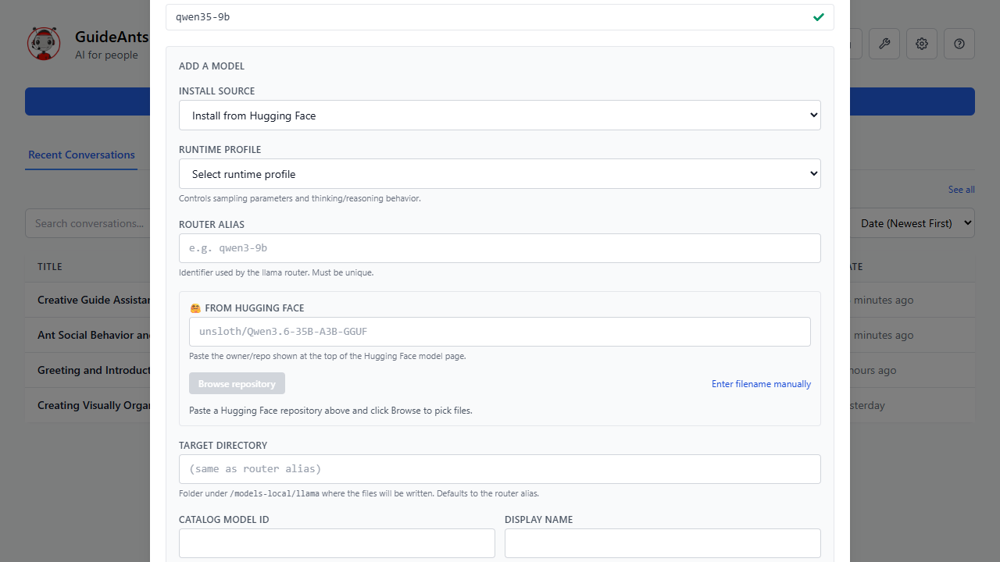

### Recommended models

| Model | Size | Use case |
|-------|------|----------|
| `Qwen3.5-9B-Q5_K_M` | ~6.5 GB | General-purpose chat with tool use |
| `Qwen3.5-14B-Q4_K_M` | ~8.5 GB | Higher quality, needs more VRAM |
| `gemma-4-12b-it-Q4_K_M` | ~7.5 GB | Good multilingual performance |

### Download flow

1. Enter or browse the Hugging Face repository (e.g., `unsloth/Qwen3.5-9B-GGUF`)
2. Select the quantization variant (e.g., `Qwen3.5-9B-Q5_K_M.gguf`)
3. Optionally select a vision projector (`mmproj`) file for multimodal support
4. Assign a Runtime Profile (controls sampling parameters and reasoning behavior)
5. Click **Download** — the model downloads in the background; progress is shown inline

The download may take several minutes depending on model size and network speed.

## Step 5: Enable Optional Services

After the chat model is configured, the wizard offers optional local services:

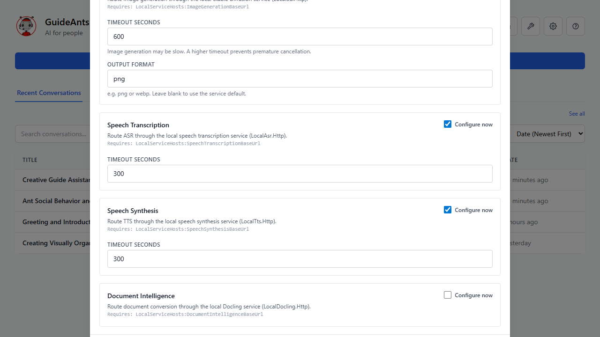

### Available services

| Service | Model example | Purpose |
|---------|---------------|---------|
| **ASR** (Speech Transcription) | `Qwen/Qwen3-ASR-0.6B` | Voice-to-text in chat |
| **TTS** (Speech Synthesis) | `microsoft/VibeVoice-1.5B` | Text-to-speech audio output |
| **Image Generation** | `flux2-klein-4b-Q4_K_S` (SD bundle) | Generate images from text prompts |
| **Embeddings** | `microsoft/harrier-oss-v1-0.6b` | Semantic search in notebooks |

Toggle each service on and select/download the appropriate model. Each service has its own model lifecycle and download flow.

### Image Generation (Stable Diffusion Bundle)

Image generation requires a 3-part SD bundle:
- **Diffusion model** — e.g., `unsloth/FLUX.2-klein-4B-GGUF` → `flux-2-klein-4b-Q4_K_S.gguf`
- **VAE** — e.g., `black-forest-labs/FLUX.2-small-decoder` → `full_encoder_small_decoder.safetensors`
- **Text encoder** — e.g., `unsloth/Qwen3-4B-GGUF` → `Qwen3-4B-Q4_K_M.gguf`

Use the "Advanced: free-text repo/file" mode if the bundle components are not listed in the preset browser.

### TTS with Tokenizer

The TTS model (e.g., VibeVoice) requires both a main model repository and a separate tokenizer repository (e.g., `Qwen/Qwen2.5-1.5B`). Browse both repositories before starting the download.

## Step 6: Complete the Wizard

Click **Finish** to apply all configurations. The wizard sets up service modes and activates your chosen providers.

## Verification

### Settings → Models & Runtime

Verify your chat model appears in the catalog and shows as "Installed":

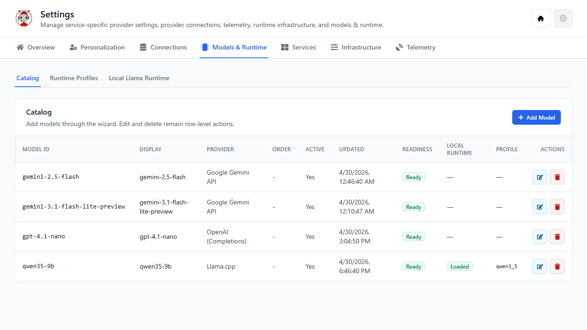

### Settings → Services

Verify each service shows its local provider as active:

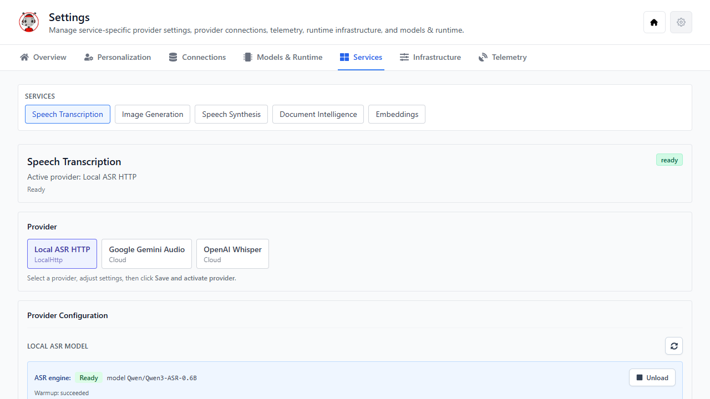

### Settings → Infrastructure

Verify all local service endpoints are reachable (green):

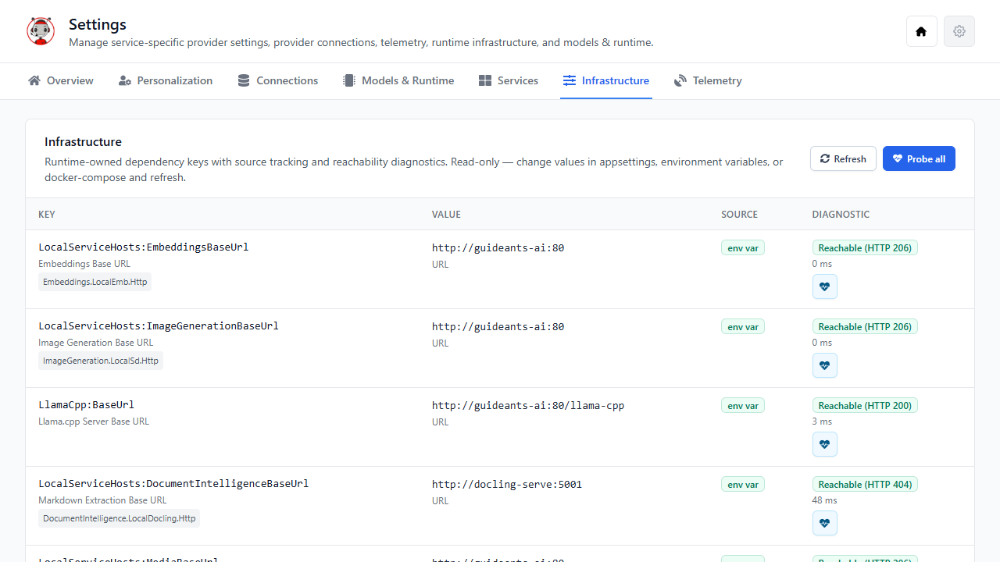

### Chat Toolbar

Open any notebook conversation. The toolbar icons should show green status dots. Hover over each icon to see the active model:

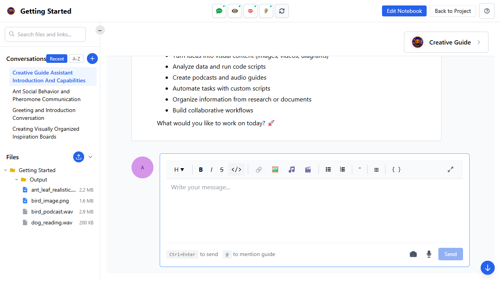

## Testing Each Service

### Chat

Send any message in a conversation. You should receive a coherent response from the local llama model.

### Image Generation

Ask the assistant to generate an image:
> "Draw a red fox in a snowy forest"

The response should include an inline PNG image.

### Text-to-Speech

Ask the assistant to speak:
> "Say hello in a friendly tone"

The response should include a playable audio element (WAV).

### Speech Transcription (ASR)

Click the microphone icon in the chat input area. Speak a phrase — it should be transcribed into the text input. (Requires browser microphone permission.)

### Embeddings

Embeddings power notebook search. Use the search feature in any notebook to verify semantic search returns relevant results.

## Troubleshooting

| Symptom | Likely cause | Fix |
|---------|-------------|-----|
| HF token check fails | Token not saved or expired | Settings → Connections → Hugging Face |
| Infrastructure shows red | Container not running | Check `docker compose` logs |
| Model download stalls | Network issue or disk full | Check container logs and free space |
| "No explicit service mode" | Service mode not registered | Re-run the wizard or manually activate via Settings → Services |
| Chat returns no response | Model not loaded | Check Models & Runtime → ensure model status is "Loaded" |
| ASR not transcribing | Browser permission denied | Grant microphone access in browser settings |

## Configuration Reference

### Key configuration paths

| Setting | Config key | Default |
|---------|-----------|---------|
| Llama-cpp base URL | `LlamaCpp:BaseUrl` | `http://localhost:8080/llama-cpp` |
| ASR service URL | `LocalServiceHosts:AsrBaseUrl` | `http://localhost:8110` |
| TTS service URL | `LocalServiceHosts:TtsBaseUrl` | `http://localhost:8110` |
| SD service URL | `LocalServiceHosts:SdBaseUrl` | `http://localhost:8110` |
| Embeddings service URL | `LocalServiceHosts:EmbeddingsBaseUrl` | `http://localhost:8110` |
| Docling service URL | `LocalServiceHosts:DocumentIntelligenceBaseUrl` | `http://localhost:5001` |
| HF token | Settings DB (encrypted) | — |

### Auto-selection behavior

At startup, if a cloud provider's connection is not configured but the corresponding local service is reachable, the local provider is automatically activated. This currently applies to Document Intelligence (Docling).

---

## Advanced Setup: Manual Configuration via Settings UI

This section covers the same setup process using the full Settings UI instead of the wizard. Use this when you need fine-grained control, want to reconfigure individual services, or are troubleshooting.

### A1. Configure the Hugging Face Token

Navigate to **Settings → Connections** and scroll to the **Hugging Face** section at the bottom. Click the Hugging Face row to expand its editor.

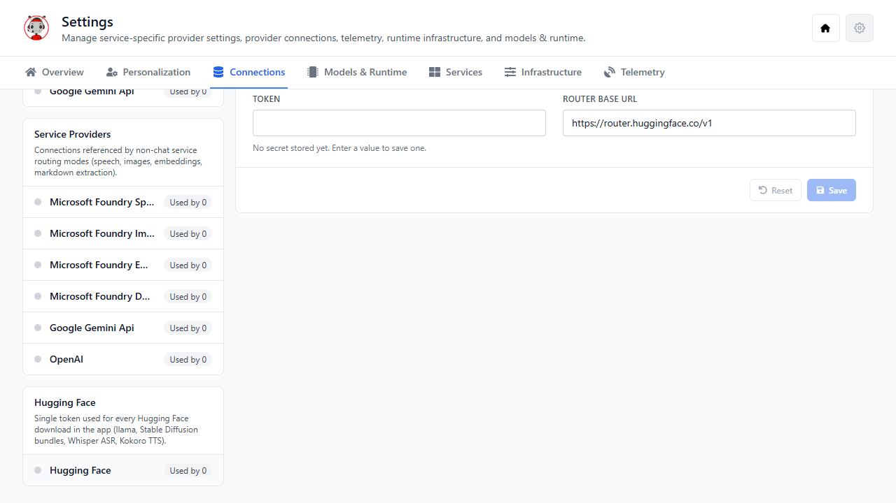

Enter your Hugging Face access token in the **Token** field and click **Save**. This token is used for all model downloads (chat GGUF files, ASR models, TTS models, SD bundles). It is encrypted at rest in the application database.

> **Tip:** Generate a token at [huggingface.co/settings/tokens](https://huggingface.co/settings/tokens). A read-only token is sufficient for downloading public models; gated models (e.g., Llama-series) require an access-approved token.

### A2. Add a Local Chat Model

Navigate to **Settings → Models & Runtime → Catalog**.

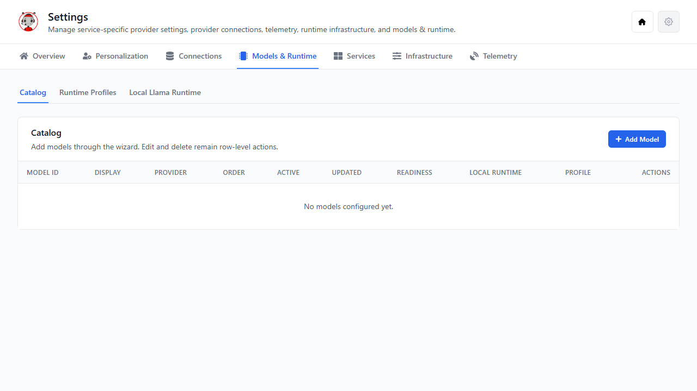

Click **Add Model** to open the model installation wizard.

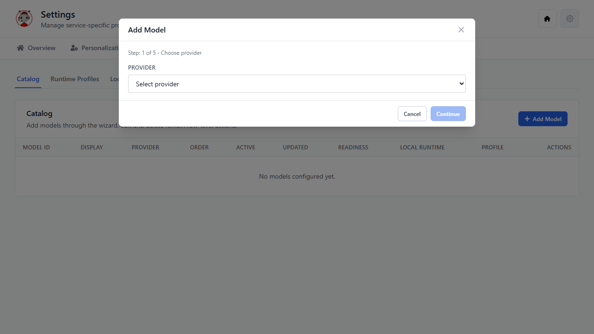

1. Select **llama-cpp** as the provider
2. Enter the Hugging Face repository (e.g., `unsloth/Qwen3.5-9B-GGUF`)
3. Select the GGUF quantization file (e.g., `Qwen3.5-9B-Q5_K_M.gguf`)
4. Optionally select a **mmproj** (vision projector) file for multimodal chat
5. Choose or create a **Runtime Profile** (controls sampling parameters)
6. Enter a **Model ID** for the catalog entry (e.g., `qwen35-9b`)
7. Click **Install** to start the download

The download progress is shown inline. Once complete, the model appears in the catalog with "Installed" status.

### A3. Configure a Runtime Profile

Navigate to **Settings → Models & Runtime → Runtime Profiles**.

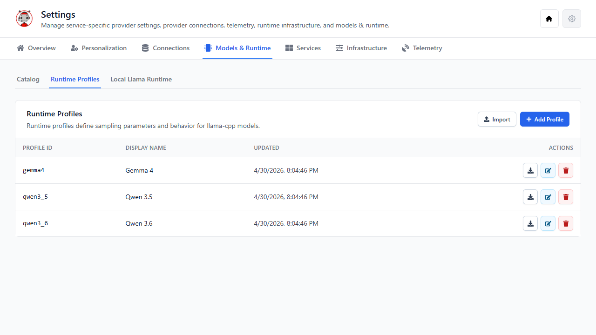

Runtime profiles control how the llama engine samples from the model during inference. Each profile defines:

- **Temperature** — randomness (0.0 = deterministic, 1.0+ = creative)
- **Top-P** — nucleus sampling threshold
- **Top-K** — vocabulary cutoff per token
- **Reasoning mode** — whether to use extended thinking (budget tokens)
- **Min-P** — minimum probability threshold
- **Repeat penalty** — discourages repetition

You can create profiles from templates (Qwen 3.5, Qwen 3.6, Gemma 4) or create fully custom ones.

### A4. Manage the Local Llama Runtime

Navigate to **Settings → Models & Runtime → Local Llama Runtime**.

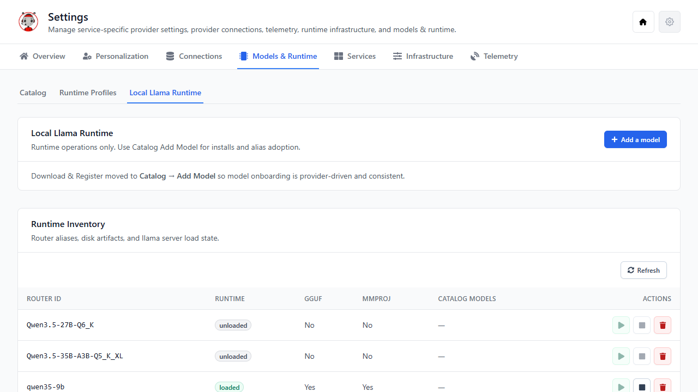

This panel shows:
- **Runtime status** — whether the llama-server process is running
- **Loaded model** — which GGUF file is currently in memory
- **GPU layers** — how many layers are offloaded to GPU
- **Context size** — maximum token context window

Use the **Load** / **Unload** controls to manage which model is active. Only one model can be loaded at a time.

### A5. Configure Non-Chat Services

Navigate to **Settings → Services**. Each service has its own sub-panel:

#### Speech Transcription (ASR)

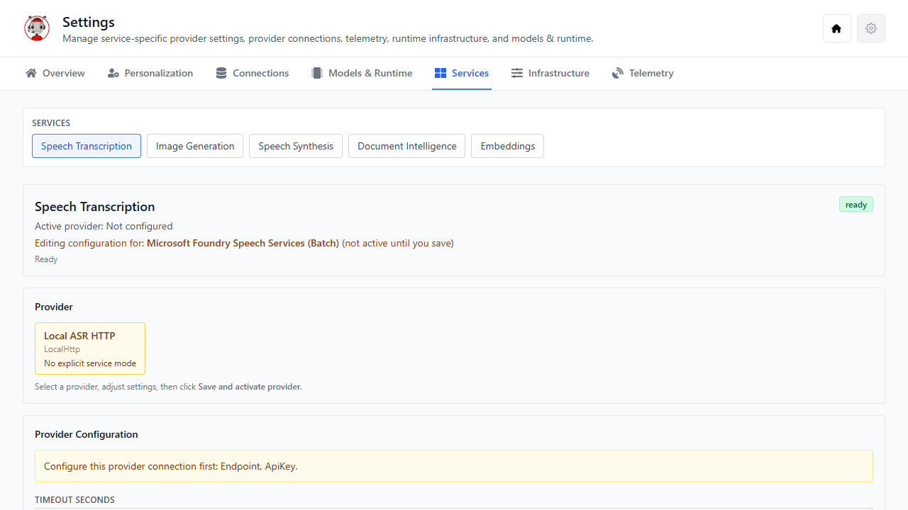

1. Select **Local ASR HTTP** from the Provider dropdown
2. The local ASR model manager appears — download/select your model (e.g., `Qwen/Qwen3-ASR-0.6B`)
3. Click **Save and activate provider**

#### Image Generation

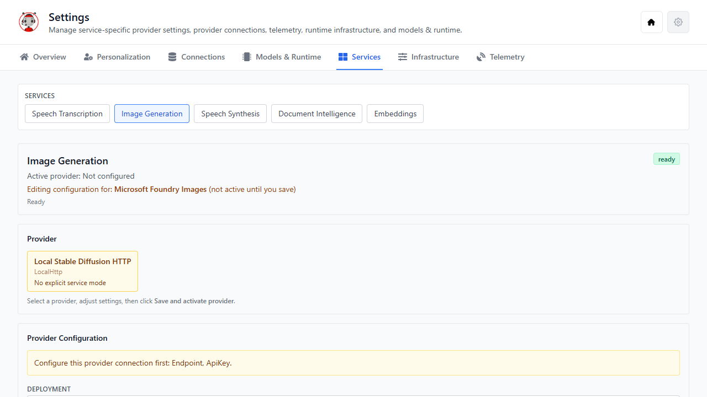

1. Select **Local Stable Diffusion HTTP** from the Provider dropdown
2. Use the SD Bundle Manager to download and activate a 3-part bundle:
   - Diffusion GGUF (e.g., `flux-2-klein-4b-Q4_K_S.gguf` from `unsloth/FLUX.2-klein-4B-GGUF`)
   - VAE (e.g., `full_encoder_small_decoder.safetensors` from `black-forest-labs/FLUX.2-small-decoder`)
   - Text encoder (e.g., `Qwen3-4B-Q4_K_M.gguf` from `unsloth/Qwen3-4B-GGUF`)
3. After download, click **Activate** on the bundle, then **Load Engine**
4. Click **Save and activate provider**

#### Speech Synthesis (TTS)

The TTS service editor works identically to ASR:
1. Select **Local TTS HTTP** from the Provider dropdown
2. Download/select your TTS model (e.g., `microsoft/VibeVoice-1.5B`)
3. The tokenizer repository (`Qwen/Qwen2.5-1.5B`) must also be browsed/fetched
4. Click **Save and activate provider**

#### Embeddings

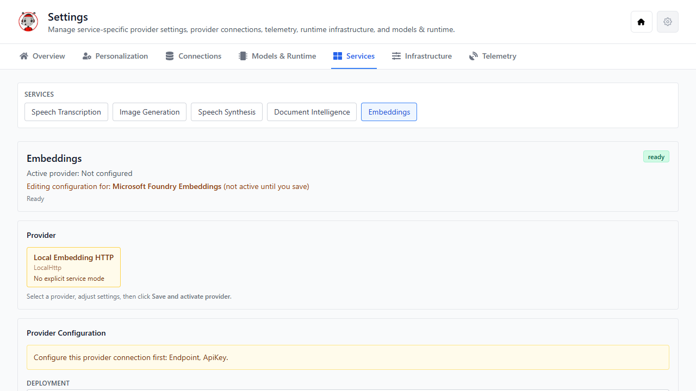

1. Select **Local Embedding HTTP** from the Provider dropdown
2. Download/select the embeddings model (e.g., `microsoft/harrier-oss-v1-0.6b`)
3. Click **Save and activate provider**

#### Document Intelligence

1. Select **Local Docling HTTP** from the Provider dropdown
2. No model download is required — Docling runs in the container
3. Click **Save and activate provider**

> **Note:** If the Docling container is reachable at startup and Azure Document Intelligence is not configured, the local provider is activated automatically.

### A6. Verify Infrastructure Reachability

Navigate to **Settings → Infrastructure**.

This tab probes all configured service endpoints and reports:
- **Green** — endpoint reachable (HTTP 1xx–4xx response within 3 seconds)
- **Red** — unreachable (timeout, connection refused, DNS failure)
- **Latency** — round-trip time in milliseconds

All local service URLs should be green before testing. If any are red, check that the Docker containers are running (`docker compose ps`).

### A7. Set the Default Chat Model

Navigate to **Settings → Overview**.

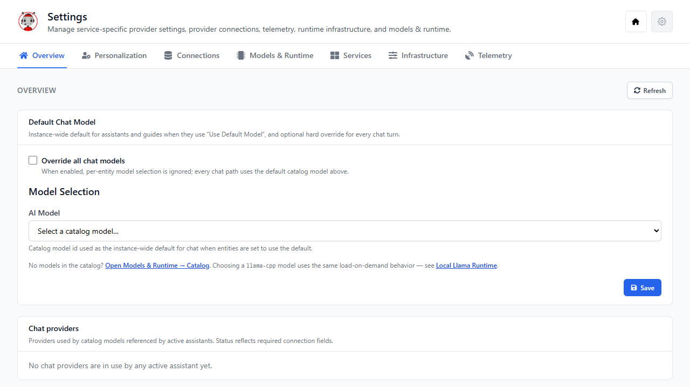

1. Enable **Override all chat models** if you want a single model for all conversations
2. Select your local model from the **AI Model** dropdown (e.g., `qwen35-9b`)
3. Adjust **Temperature** and **Top P** sliders as desired
4. The setting is saved automatically

### A8. Verify in Chat

Open any conversation. The toolbar should show green status dots on all service icons. Hover over each to confirm the active model name appears in the tooltip. Send test messages to verify:

- Chat responses come from the local model
- Image generation produces PNG results
- TTS produces audio playback
- ASR transcribes voice input
- Notebook search returns semantic results (embeddings)
