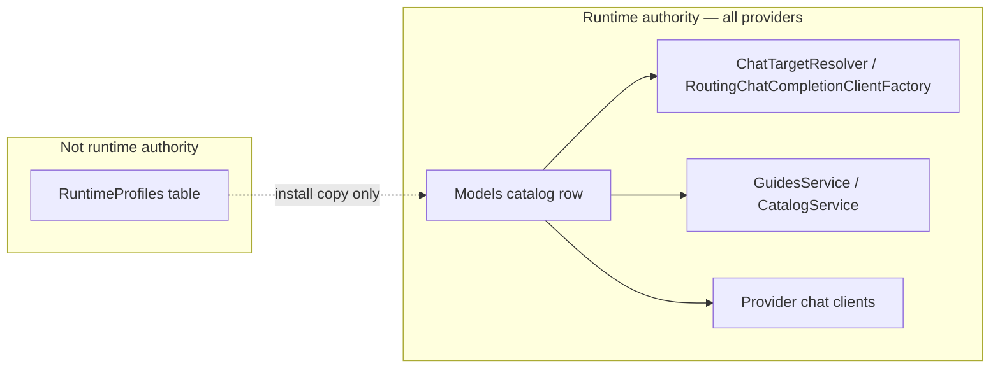

# Model Chat Behavior Contract

**Canonical reference for contributors, operators, and planning agents.**

Last updated: 2026-08-10

This document defines where sampling, reasoning, and request-shaping configuration lives for **every catalog model** — OpenAI, Anthropic, Google Gemini, Hugging Face Inference, OpenRouter, Azure OpenAI, and llama-cpp. It is not a local-model-only topic.

Read this before adding any model row, any provider integration, any curated llama manifest entry, or any feature that touches chat parameters in guides, assistants, or Settings.

---

## Rule (read this first)

**The `Models` catalog row owns chat behavior at runtime — for every provider.**

Runtime profiles are **not** the product model for configuring how any model chats. Do not add new runtime profiles, a Runtime Profiles settings workflow, or `runtimeProfileId` pointers in `RuntimeConfigJson` when designing new features — cloud or local.

| Concern | Authority | Notes |
|---------|-----------|--------|
| Sampling sliders & defaults | `Models.SamplingParametersJson` | All providers with a parameter surface |
| Reasoning effort choices | `Models.ReasoningChoicesJson` | All providers that expose reasoning in builders |
| Request shaping (thinking, extra body fields) | `Models.ThinkingControlJson`, `RequestFieldsWhenToolsPresentJson` | llama-cpp, `hf-inference-chat`, `openrouter-chat`; others use typed clients + row fields where applicable |
| Message normalization | `CombineSystemAndDeveloperMessages`, `ThoughtBlockPattern` | Primarily llama-cpp |
| Router / deployment binding | `Models.RuntimeConfigJson` | llama-cpp: `{"routerModelId":"<alias>"}` only. Cloud: null or provider-specific JSON **without** profile pointers |

At inference, routing and chat clients read **model row columns** via `ModelChatBehavior` / `CatalogService` / `GuidesService` — not `IRuntimeProfileResolver`.

Tests: `ModelOwnedChatBehaviorTests`, `CatalogServiceRowAuthorityTests`, `ProviderChatBehaviorTests`.

---

## Scope by provider

| Provider family | Row-owned at inference | Runtime profile involvement |
|-----------------|------------------------|----------------------------|
| `openai-chat`, `openai-responses`, `azure-openai-*` | `SamplingParametersJson`, `ReasoningChoicesJson` | **None** — profile tab and `runtimeProfileId` in config were removed (PR #107) |
| `anthropic`, `google-gemini-chat` | Same | **None** |
| `hf-inference-chat`, `openrouter-chat` | Above + `ThinkingControlJson`, `RequestFieldsWhenToolsPresentJson` | **None** (PR #120) |
| `llama-cpp` | Full chat-behavior surface on row | **Install-time copy only** from bootstrap template (see below) |

There is no separate “cloud contract” vs “local contract.” One table (`Models`), one authority model. Local llama adds router binding and an install copy bridge; cloud models never use that bridge.

### The install bridge — precise scope

**Not an exception to runtime authority.** At chat inference, every provider reads the model row. `IRuntimeProfileResolver` is not called on the routing or guide-validation hot path.

The bridge is a **one-time copy helper** when a **new llama-cpp catalog row is created** through paths that do not already submit row-owned JSON:

| Path | Uses `RuntimeProfiles`? | What happens |
|------|-------------------------|--------------|
| Cloud / API `POST /models:add` | **No** | Wizard/modal JSON written directly to `Models` columns |
| Curated llama install | **Yes** | `CuratedInstallResolver` validates manifest `runtimeProfileId` exists; `CommitFinalizationAsync` resolves profile and **copies** fields onto the new row |
| Custom HF onboarding | **Yes** | Operator picks profile at install; fields copied to row at create (`LocalModelOnboardingOrchestrator` legacy path) |
| Attach existing alias (row-owned) | **No** | Client submits chat-behavior JSON; no profile resolve |
| Edit catalog row after install | **No** | `PUT /models/{id}` updates row columns |
| Adopt / Repair lifecycle | **No** for chat behavior | Updates router preset / provenance; does **not** re-copy profile → row |

After the copy (or direct write), the `RuntimeProfiles` row is **not** consulted again for that model's chat behavior unless an operator uses the legacy install paths again on a new row.

**Still exists but not part of chat authority:**

- `GET/POST/PUT/DELETE /api/settings/runtime-profiles` — CRUD without a Settings tab; not the operator model for configuring models
- `RuntimeProfileSeeder` — idempotent bootstrap of template rows from JSON files
- `BackfillNonLocalModelRowAuthority` (historical) — one-time cloud backfill from profiles, then cleared pointers

So “narrow” means: **one lifecycle moment** (local row creation via curated/legacy HF), **one provider family** (llama-cpp), **copy-only** — not a second authority layer and not applicable to cloud models.

### Why the bridge should be removed

The install bridge is **liability**, not a feature:

| Liability | Effect |
|-----------|--------|
| **Dual authoring** | Curators maintain bootstrap profile JSON *and* manifest pointers; operators edit model rows — three places for one behavior |
| **Wrong default for planners** | “Add `muse_glimmer.json` profile” follows naturally from manifest `runtimeProfileId` — we just fought this |
| **Shared templates** | Many manifest rows point at `qwen3_6`; per-model behavior differences cannot live in the recipe |
| **Install fragility** | Curated install fails if bootstrap profile missing (`RUNTIME_PROFILE_NOT_FOUND`) though behavior could live in manifest |
| **Dead weight** | `RuntimeProfiles` table, seeder, CRUD API, resolver cache, unused DI in `GuidesService` / `ApplicationSettingsService` |
| **Incomplete lifecycle** | Adopt/Repair never re-copy profile → row, so manifest/profile changes do not flow to installed models anyway |

**Target state:** manifest `defaults.chatBehavior` (or equivalent) is the curated recipe; curated install writes model-row columns directly. No `runtimeProfileId`, no `IRuntimeProfileResolver` on install paths, no bootstrap profile files for new models.

### Install bridge removal (shipped)

Steps 1–4 below are **implemented**. Curated install reads `defaults.chatBehavior` from the manifest and writes model-row columns directly — no profile resolve on install paths.

1. **Schema** — `defaults.chatBehavior` replaces `defaults.runtimeProfileId` in `schema.llama.json` and contract fixtures.
2. **Manifest** — All curated entries embed chat behavior inline (`embed_manifest_chat_behavior.py` migration from bootstrap profiles).
3. **Curated pipeline** — `CuratedImmutableOperationInput` carries chat-behavior strings; `CuratedInstallResolver` validates manifest JSON; `CommitFinalizationAsync` writes row columns without `IRuntimeProfileResolver`.
4. **Legacy HF** — Requires `providerConfig` chat-behavior JSON at install (same as attach-alias row-owned path); install-time profile picker removed from validator/orchestrator.
5. **Retired** — `RuntimeProfiles` table, CRUD API, bootstrap `runtime-profiles/` folder, and `IRuntimeProfileResolver` removed. Chat behavior types (`RuntimeProfileData`, etc.) remain as in-memory shapes for model-row JSON.

---

## What runtime profiles were (historical)

Before row-owned behavior, **cloud and local** models could point at shared `RuntimeProfiles` rows (or `runtimeProfileId` inside `RuntimeConfigJson`). That caused drift: guide builders read profile definitions while operators edited catalog rows, and adding a compatible model shape required shipping a new profile entity.

Migrations moved authority onto model rows for **all** providers:

| Change | Who it affected |
|--------|-----------------|
| PR #107 — row-owned surfaces | Cloud / API catalog models; Settings Runtime Profiles tab removed |
| PR #120 — request shaping on row | `hf-inference-chat`, `openrouter-chat` |
| `AddModelOwnedChatBehavior` | `llama-cpp` — full surface on row; `RuntimeConfigJson` → `routerModelId` only |
| `BackfillNonLocalModelRowAuthority` | One-time cloud backfill from profiles, then cleared profile pointers |

---

## Settings UX (all providers)

Operators configure chat behavior on the **catalog model row**:

| Provider | Editor | Fields |
|----------|--------|--------|
| Cloud / API (default) | `NonLocalModelParameterSurfaceEditor` | `samplingParametersJson`, `reasoningChoicesJson` |
| HF Inference, OpenRouter | Above + thinking / request fields | `thinkingControlJson`, `requestFieldsWhenToolsPresentJson` |
| llama-cpp | `LlamaModelChatBehaviorEditor` | Full chat-behavior JSON on the row |

Optional seeds: `parameterSurfaceSeeds.ts`, `knownCloudModels.json` (cloud typeahead).

Local installations: `ModelChatBehaviorPanel` handles Repair / Adopt for router preset and provenance; **sampling and reasoning editing stays on the catalog row form**.

No runtime-profile picker in Settings. Legacy custom HF install still has a profile dropdown at install only — **remove with the bridge** (require row JSON in `providerConfig` instead).

---

## How to add configuration for a new model

### Any cloud / API model (default path)

1. Add a catalog row via Settings or `POST /api/settings/models:add`.
2. Set `SamplingParametersJson` and `ReasoningChoicesJson` on the row.
3. For HF / OpenRouter, add `ThinkingControlJson` and `RequestFieldsWhenToolsPresentJson` when needed.
4. **Do not** create a runtime profile or reference `runtimeProfileId`.

### Curated local llama (manifest entry) — target

1. Add manifest entry with HF source, `routerPreset`, and **`defaults.chatBehavior`** (inline JSON — same shape as model row columns).
2. Rebuild `guideants-ai` image.
3. Install writes behavior directly to the model row; operators edit the row thereafter.

Until the bridge is removed, manifest still has `runtimeProfileId` — **do not add new profile files**; reuse an existing template id only as a stopgap.

### Custom local HF / attach alias

Attach-alias: submit chat-behavior JSON in `providerConfig`. Custom HF: same (after bridge removal); today may still use install profile picker — liability.

---

## JSON field reference (model row)

| Column | Purpose | Typical providers |
|--------|---------|-------------------|
| `SamplingParametersJson` | Parameter definitions + defaults for builders and requests | All with a parameter surface |
| `ReasoningChoicesJson` | Allowed reasoning effort strings | Most chat providers |
| `ThinkingControlJson` | Maps choices to request actions | llama-cpp, HF, OpenRouter |
| `RequestFieldsWhenToolsPresentJson` | Extra body fields when tools present | llama-cpp, HF, OpenRouter |
| `CombineSystemAndDeveloperMessages` | Message normalization | llama-cpp |
| `ThoughtBlockPattern` | Strip thinking blocks from output | llama-cpp (and similar) |

Thinking action targets: `RequestField`, `NestedRequestField`, `SystemMessagePrefix`. Use existing manifest entries or model rows as **shape examples** — not new `runtime-profiles/*.json` files.

---

## Anti-patterns (do not ship these)

| Anti-pattern | Why it fails |
|--------------|--------------|
| New runtime profile for a cloud model (Gemini, GPT, Claude, etc.) | Cloud path never uses profiles at install or inference |
| New `Resources/bootstrap/runtime-profiles/<family>.json` per model | Revives shared-profile authority; misleads planners |
| `runtimeProfileId` in `RuntimeConfigJson` (any provider) | Rejected for non-local; stripped for llama |
| Runtime Profiles tab or global profile management UX | Removed; behavior belongs on each model row |
| `IRuntimeProfileResolver` in new chat/routing code | Inference must read model columns |
| Treating this as a “local llama” architecture topic | Same row authority applies to every provider |

---

## Related docs

- Cloud/API surface detail: [model-sampling-policy-regression-fix.md](model-sampling-policy-regression-fix.md)
- Settings persistence: [settings-architecture.md](settings-architecture.md)
- Operator walkthrough: [adding-models.md](adding-models.md)
- Local llama lifecycle (router, load/unload — not chat authority): [llama-model-download-and-runtime-management.md](llama-model-download-and-runtime-management.md)
- Llama manifest schema: `docker/build/guideants-ai/llama-admin-service/catalog/schema.llama.json`

## Stale planning docs

Plans that describe runtime profiles as layer-3 authority (e.g. `docs/llama-router-preset-ui-execution/ux-redo-plan.md`) are **historical** for all providers, not only local models.
