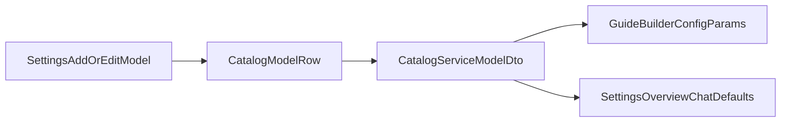

# Model Parameter Surface — Row-Owned Non-Local Contract

## Problem Statement

Guide Builder, Assistant Builder, and Settings Overview only render sampling / reasoning controls when the catalog API exposes a model's parameter surface. Historically, non-local models delegated that surface to a persisted `runtimeProfileId` pointer in `RuntimeConfigJson`, which drifted from the model row and blocked editing compatible model shapes without shipping new runtime profiles.

## Target Contract

For every model (including `llama-cpp`):

- **Authority:** model-row fields (`SamplingParametersJson`, `ReasoningChoicesJson`, and for llama the full chat-behavior surface including `ThinkingControlJson`)
- **Settings UX:** operators edit those fields on the catalog row / Add Model forms. There is no runtime-profile picker in Settings.
- **Runtime config:** non-local models do **not** persist `RuntimeConfigJson` profile pointers; llama canonical runtime JSON is `routerModelId` only

## Write Path

- Settings Add Model wizard and catalog edit modal submit row-owned `samplingParametersJson` / `reasoningChoicesJson`.
- `POST /api/settings/models:add` accepts those fields in `providerConfig` and persists them on the model row.
- `PUT /api/settings/models/{id}` rejects non-local `runtimeProfileId` pointers in `runtimeConfigJson`.

## Read Path

- `CatalogService.GetModelsAsync()` builds `samplingParameterPolicy` and `reasoningChoices` from model-row fields for non-local providers.
- `GuidesService` validates temperature / top-p / reasoning effort against row-owned sampling definitions and `ReasoningChoicesJson`.
- `ApplicationSettingsService` resolves effective reasoning choices from the model row (llama-cpp may still derive from `ThinkingControlJson` when the array is absent).

## Migration

`BackfillNonLocalModelRowAuthority` copies missing non-local sampling/reasoning fields from linked runtime profiles once, then clears non-local `RuntimeConfigJson` profile pointers.

## Row-Owned Request Shaping (`hf-inference-chat`, `openrouter-chat`)

Both clients also honor the row's `ThinkingControlJson` and `RequestFieldsWhenToolsPresentJson`, projected onto
`ProviderChatBehavior` by `RoutingChatCompletionClientFactory`:

- **Thinking control** — when the row defines actions for the selected reasoning choice, they replace the client's
  built-in reasoning mapping (OpenRouter's `reasoning` object, Hugging Face's `reasoning_effort`). This is how a model
  reaches `chat_template_kwargs.enable_thinking`, which is what actually toggles thinking on Qwen/GLM-style models
  behind the HF router. Choices the control does not cover keep the built-in mapping.
- **Extra request fields** — merged into every completion body (`parallel_tool_calls`, `seed`, …). Sampling parameters
  remain numeric-only, so this is the route for non-numeric body fields. `RuntimeProfileRequestFieldsValidator` accepts
  **primitives only**; a field whose value is an object (OpenRouter `reasoning`, `provider`) has to go through a
  `RequestField` thinking action instead. Note the sharp edge: an object value here throws during row parse, and the
  non-local resolver treats a failed parse as "no behavior", silently dropping the row's thinking control as well.

Both default to `{}` (unconfigured), which leaves request bodies byte-identical to before. Other non-local providers
build typed request bodies and ignore these columns, so the catalog editor hides the fields for them.

## Adding a New Compatible Cloud Model

1. Add the catalog row via Settings (or API) with the desired `SamplingParametersJson` / `ReasoningChoicesJson`.
2. Known-model typeahead may pre-fill those fields from `parameterSurfaceSeeds.ts` / `knownCloudModels.json`.
3. No runtime profile is involved.

## Explicit Non-Goals

- Runtime profiles are not Settings UX and are not authority for model parameter surfaces.
- Server-side save normalization that rewrites submitted chat-default or catalog payloads is not part of this contract.
