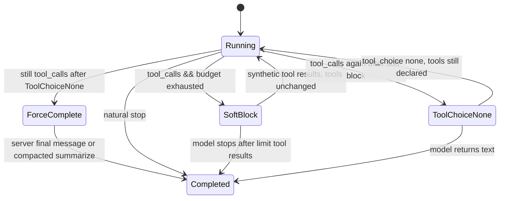

# Per-Assistant Tool Call Limits Proposal

Status: Proposal (ready for implementation)  
Last updated: 2026-07-12  
Owner: Guide/assistant builder + conversation runtime  
Related:
- [Conversation Stream Reconnect and Server Cancel](./conversation-stream-reconnect-and-cancel-proposal.md)
- `src/client/src/components/guides/editor/ToolsTab.tsx`
- `src/client/src/components/guides/editor/CrewTab.tsx`
- `src/client/src/components/guides/editor/BaseEntityEditor.tsx`
- `src/server/GuideAntsApi.DataModel/Models/Assistant.cs`
- `src/server/GuideAntsApi.DataModel/Models/GuideMember.cs`
- `src/server/AntRunner.Chat/AntRunner.Chat/ThreadRun.cs`
- `src/server/AntRunner.Chat/AntRunner.Chat.Abstractions/ChatCompletionRequest.cs`
- `src/server/AntRunner.Chat/AntRunner.ToolCalling/InvocationContext.cs`
- `src/server/GuideAntsApi/Services/Conversations/Agent.cs`
- `src/server/GuideAntsApi/Resources/bootstrap/guides/creative-guide/assistants/Search/instructions.md`

## 1. Problem Summary

Long-running turns (especially Creative Guide / Search with many `ReadWeb` and `WebSearch` calls) can run for tens of minutes, hold the conversation lock, and exhaust local LLM capacity. There is **no per-assistant cap** on tool usage within a single turn.

Published guides have `MaxTurns` (conversation-level), but nothing limits **tool calls inside one turn**. The Search assistant instructions explicitly require retries when citations are insufficient, which amplifies runaway behavior when combined with site 403s and slow fetches.

Operators need to configure limits in the **guide/assistant builder** and have the **conversation runtime enforce them in all execution paths** — without killing the turn or triggering upstream LLM API validation errors.

## 2. Goals

1. Allow optional per-assistant limits in builder, bootstrap manifests, and export/import.
2. Enforce limits in **every** `ThreadRun` scope: private notebook, published, and nested `Agent.Invoke` (crew).
3. When a limit is reached, persist a clear message that configured limits block further tool calls.
4. Complete the turn gracefully (`status: completed`) even when the model keeps requesting tools.
5. Stay compatible with **upstream chat providers** (OpenAI-compatible, Anthropic, llama.cpp) — do not rely on request shapes that cause 400s.

## 3. Non-goals

1. Changing Search retry policy or ReadWeb timeouts (separate product decisions).
2. Published-guide `MaxTurns` / cost limits (already exist on `PublishedGuide`).
3. Client-handled tool wire semantics changes.
4. Billing/usage caps disguised as tool limits (limits are runtime safety, not metering).

## 4. Configuration Model

### 4.1 Fields

| Field | Scope | Meaning |
|-------|-------|---------|
| `max_tool_calls_per_turn` | `Assistant` | Max server-executed tool invocations in one `ThreadRun` |
| `max_tool_rounds_per_turn` | `Assistant` (optional) | Max LLM rounds with `finish_reason: tool_calls` |
| `max_tool_calls_per_invocation` | `GuideMember` (optional) | Override for a crew member when invoked via `Agent.Invoke` |

All nullable. `null` = unlimited (backward compatible).

### 4.2 Storage and surfaces

| Layer | Change |
|-------|--------|
| DB | `Assistants.MaxToolCallsPerTurn`, `Assistants.MaxToolRoundsPerTurn`; optional `GuideMembers.MaxToolCallsPerInvocation` |
| DTOs | `CreateGuideDto`, `UpdateGuideDto`, `CreateAssistantDto`, `UpdateAssistantDto`, client `guides.ts` |
| Bootstrap | `"max_tool_calls_per_turn": 12` in assistant/guide manifests |
| Export/import | `GuideExportImportService` |
| Runtime | `AssistantDefinition` or `ChatRunOptions` + `InvocationContext.ToolLimitState` |
| Builder UI | **Tools** tab → “Execution limits” section (distinct from published `LimitsTab`) |
| Crew tab | Read-only summary of each member’s limits |

### 4.3 Suggested bootstrap defaults

| Assistant | `max_tool_calls_per_turn` | Rationale |
|-----------|---------------------------|-----------|
| Search | 12–15 | crawl + multiple ReadWeb per attempt × retries |
| Guide orchestrator | 20–25 | crew invokes + light tools |
| Code Executor | 8–10 | `run_python` loops |
| Unset | `null` | existing guides unchanged |

## 5. Counting Semantics

### What counts

- Each tool executed (or blocked at limit) in `DoToolCalls` = **1**
- Parallel batch of 4 tools in one round = **4**
- `Agent.Invoke` at parent = **1** parent tool call; nested run has its **own** budget inside the child `ThreadRun`
- `ReadWeb` (`GetContentFromUrl`) = **1** per call (local function, same loop — not a nested `ThreadRun`)

### Scoped budgets (nested crew)

```
Parent budget:  Guide.MaxToolCallsPerTurn (if set)
Child budget:   min(remaining parent budget,
                   GuideMember.MaxToolCallsPerInvocation ?? ChildAssistant.MaxToolCallsPerTurn)
```

Pass `ToolLimitState` through `InvocationContext`:

```csharp
record ToolLimitState(
    int? MaxToolCalls,
    int? MaxToolRounds,
    int ToolCallsUsed,
    int ToolRoundsUsed,
    LimitEscalationPhase Phase);

enum LimitEscalationPhase { None, SoftBlocked, ToolChoiceNone, ForceCompleted }
```

### Client-handled tools

Count toward the same budget when `external_tool_call` / `pending_client_tool` is emitted (recommended for consistency).

## 6. Enforcement Point

**Primary:** `ThreadRun.ExecuteAsync`, `case "tool_calls"` — before `DoToolCalls`.

Secondary paths (`ConversationStreamEngine`, GET APIs) are too late; all stream entry points delegate to `ThreadRun`.

```
User message → ConversationStreamEngine → ThreadRun loop:
  LLM → tool_calls? → [limit check] → DoToolCalls → tool messages → LLM → … → stop
    └─ Agent.Invoke → nested ThreadRun (separate ToolLimitState, depth+1)
```

## 7. Upstream Provider Constraints

Limits must not assume GuideAnts can reshape history arbitrarily. **Upstream** chat APIs (OpenAI-compatible, Anthropic, llama.cpp) validate message sequences.

### Rules that cause 400s

| Violation | Typical provider response |
|-----------|---------------------------|
| `role: tool` without matching prior assistant `tool_call_id` | 400 invalid message sequence |
| `tool_calls: []` or `tool_calls: null` on assistant messages | 400 (OpenAI) |
| Tool results for IDs the assistant never requested | 400 on strict servers |
| Orphan assistant `tool_calls` without corresponding tool results | 400 / retry failures |

GuideAnts already handles pairing correctly for context overflow (`ThreadRun.BuildAbortReplacement` preserves `tool_call_id`).

### What is **not** safe cross-provider

**Omitting the `tools` array** on a completion request while sending raw history that still contains:

- assistant messages with `tool_calls`
- `role: tool` messages

Some OpenAI-compatible servers accept this; others (including some llama.cpp builds) are inconsistent. GuideAnts’ `LlamaCppChatClient` always serializes tool messages in history and only adds `tools` to the body when `request.Tools.Count > 0`.

**Therefore:** do not use “no-tools round” (strip `tools` from request, keep tool-shaped history) as a general completion strategy.

### What **is** safe

| Approach | Provider safety |
|----------|-----------------|
| Synthetic `tool` result per `tool_call_id` (limit message), **tools still in request** | Valid pairing; same as `ERROR:` tool failures today |
| `tool_choice: "none"` with **tools still declared** | OpenAI-native; forbidden new calls, history unchanged |
| Server-authored final assistant message (no further LLM call) | No upstream request |
| Compacted history for one summarization call (no `tool` roles, no `tool_calls`) | API-safe; precedent in `Conversation` handoff |

## 8. Provider-Safe Escalation Ladder

When a limit is reached, escalate without throwing (never `error` / `cancelled` for limit exhaustion).



### Tier 1 — Soft block (default)

When budget is exhausted and model returns `tool_calls`:

1. **Do not execute** pending tools.
2. For **each** requested `tool_call`, append a persisted `tool` message:

   ```
   [Tool call limit reached (12/12 configured for this assistant).
   No additional tool calls are permitted for this turn.
   Summarize what you have gathered and respond to the user.]
   ```

3. Emit `tool_result` SSE as usual.
4. **Keep the full `tools` array** on the next completion request.
5. Optionally add a **system** message for the user:

   ```
   [Configured tool call limit reached. Further tool use is blocked for this turn.]
   ```

6. Set `Phase = SoftBlocked`; continue loop.

This mirrors existing `DoToolCalls` error strings — structurally valid for all providers.

### Tier 2 — `tool_choice: "none"` (OpenAI-compatible)

If the model requests tools again after Tier 1:

1. Keep `tools` in the request.
2. Set `tool_choice: "none"` (requires new field on `ChatCompletionRequest` and mapping in `OpenAiChatClient`, `LlamaCppChatClient`, etc.).
3. Add system/developer nudge: respond in plain text using gathered evidence only.
4. Set `Phase = ToolChoiceNone`.

**Preferred** over omitting `tools`. Not all providers support `tool_choice`; gate by provider capability (see §8.5).

### Tier 3 — Force complete without tool-capable LLM call

If the model still returns `tool_calls` after Tier 2 (common with Search “MUST TRY AGAIN” instructions):

1. Persist any final limit tool results for the pending batch (pairing).
2. Append a **server-authored assistant** message:

   ```
   I reached the configured tool call limit (12/12) before completing all requested
   research. Partial results from earlier tool calls are shown above.
   ```

3. Set `continueChat = false`; turn `completed`.
4. Set `Phase = ForceCompleted`.

No upstream validation risk — no ambiguous tool-history request.

### Tier 4 — Compacted summarization LLM call (optional quality upgrade)

If a real model-written summary is desired after Tier 3 would fire:

Build a **tool-free** message list for a single completion:

- System + user messages: unchanged.
- Collapse tool work into one **user** message: `[Tool results gathered before limit]\n…`
- **Omit** assistant messages that only contain `tool_calls`.
- **Omit** all `role: tool` messages.
- Request with **no `tools` param**.

Precedent: `Conversation` assistant handoff filters `Assistant && ToolCalls != null` from history.

Lossy (exact tool structure gone) but safe for llama.cpp, OpenAI, and Anthropic. Use only when Tier 3 stub quality is insufficient.

### Tier 5 — Runtime instruction override

When `Phase >= SoftBlocked`, prepend to system context for remaining rounds:

```
[Runtime: Tool call limit reached. Ignore prior instructions to retry tool calls for this turn.]
```

Mitigates conflict with Search citation-retry instructions without silent fallback retries.

### 8.5 Provider capability matrix

| Provider | Tier 1 | Tier 2 (`tool_choice: none`) | Tier 3 | Tier 4 |
|----------|--------|------------------------------|--------|--------|
| OpenAI / OpenRouter | Yes | Yes | Yes | Yes |
| LlamaCpp (OpenAI wire) | Yes | Verify per build | Yes | Yes |
| Anthropic | Yes | Map to equivalent if available; else skip to Tier 3 | Yes | Yes (native tool_result blocks → collapsed text) |
| Google Gemini | Yes | Verify | Yes | Yes |

Implement capability flags on `IChatCompletionClient` or runtime profile: `SupportsToolChoiceNone`.

## 9. What to Avoid

| Anti-pattern | Why |
|--------------|-----|
| Throw on limit | `ConversationStreamEngine` → `error`; broken UX |
| Omit `tools` while sending `role: tool` history | Upstream 400 risk |
| Only `streaming_progress` | Not persisted; model doesn’t see it |
| Silent drop of tool calls | Breaks `tool_call_id` pairing |
| Reset budget on evaluator reopen | Defeats limit; evaluator loop must inherit `ToolLimitState` |
| Hidden retry after limit | Violates operator intent |

## 10. Builder UI

**Tools tab** → “Execution limits” (below tool selection):

- Max tool calls per turn (number, blank = unlimited)
- Max tool rounds per turn (advanced, collapsed by default)

**Crew tab** → per-member read-only limit display + link to edit member assistant.

Help text: “When reached, the assistant receives a limit message and must finish the turn with gathered results. Does not affect published conversation turn limits.”

## 11. API / Runtime Changes

### `ChatCompletionRequest`

```csharp
// New optional field
public string? ToolChoice { get; }  // null = default, "none" = forbid tool calls
```

### `ThreadRun` limit hook (pseudocode)

```text
case "tool_calls":
  if (WouldExceedLimit(serverHandled, state)) {
    await InjectLimitToolResults(serverHandled, tracedMessageAdded);
    if (state.Phase == None) state.Phase = SoftBlocked;
    else if (state.Phase == SoftBlocked && SupportsToolChoiceNone)
      { nextRequest.ToolChoice = "none"; state.Phase = ToolChoiceNone; }
    else
      { await ForceCompleteTurn(...); continueChat = false; }
    break;
  }
  await DoToolCalls(...);
  IncrementCounters(serverHandled.Count);
```

## 12. Implementation Phases

### Phase A — Core limit + Tier 1

1. DB + DTO + bootstrap + builder UI for `max_tool_calls_per_turn`.
2. `ToolLimitState` on `InvocationContext`.
3. Soft block in `ThreadRun` with synthetic tool results.
4. Tests: hit limit mid-batch; nested `Agent.Invoke` budget; published + private paths.

### Phase B — Tier 2 + Tier 3

1. `ToolChoice` on `ChatCompletionRequest` + provider mapping.
2. Escalation state machine.
3. Runtime instruction override for retry-heavy guides.
4. Tests: model retries after soft block → force complete without 400.

### Phase C — Optional Tier 4 + polish

1. History compaction for summarization call.
2. `max_tool_rounds_per_turn` + crew overrides.
3. Bootstrap defaults for Search / Creative Guide.
4. Usage/reporting: expose limit-hit count in turn trace.

## 13. Testing Plan

### Server

- 12th tool executes; 13th batch → synthetic tool results, no execution.
- Model retries after soft block → Tier 2 or Tier 3 fires; turn `completed`.
- No upstream 400 with llama.cpp client tests (mock server validates message body).
- Nested `Agent.Invoke`: child limit independent; parent budget decrements.
- Evaluator reopen inherits limit state.

### Manual

1. Set Search `max_tool_calls_per_turn: 5`; ask research question → limit message in workflow, turn completes with partial answer.
2. Creative Guide long run → Stop (reconnect proposal) or limit — lock releases.
3. Export/import preserves limits.

## 14. Relation to Stream Reconnect Proposal

- Limit exhaustion should **complete the turn** and release the lock — same terminal path as normal completion.
- Reconnect/cancel applies while under budget; limits bound worst-case duration.
- Turns ended by limit should rehydrate correctly on return (no empty cell).

See [conversation-stream-reconnect-and-cancel-proposal.md](./conversation-stream-reconnect-and-cancel-proposal.md).

## 15. Decisions

| Decision | Choice |
|----------|--------|
| Strip `tools` from request for completion | **No** — upstream 400 risk |
| Primary safe completion | Synthetic tool results + keep tools declared |
| Forceful completion | Server assistant message or compacted history |
| `tool_choice: none` | Yes, when provider supports it |
| Limit scope | Per `ThreadRun` with nested budget inheritance |
| Throw on limit | Never |

## 16. Success Criteria

- [ ] Builder exposes optional per-assistant tool call limits.
- [ ] Limits enforced in private, published, and nested `Agent.Invoke` paths.
- [ ] Limit reached → persisted limit message visible to user and model.
- [ ] Turn completes as `completed` even when model retries (Search-style).
- [ ] No upstream provider 400s from limit handling in llama.cpp / OpenAI integration tests.
- [ ] Bootstrap Search has a sensible default limit.
