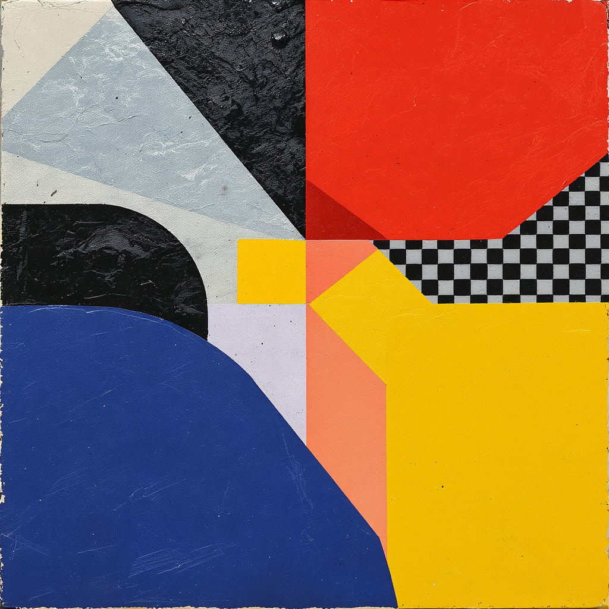

# Building the Slide Show Guide


---

# Goals and Plan

- Create a companion script to the Word converter for slide shows
- Generate Markdown content and images programmatically
- Convert Markdown to HTML for slide content
- Export slides as PPTX and/or PDF
- Design visually appealing and professional slides

---

# Image Tests

|  |          |          |
|---|---|---|
|          |          |  |

---

# Table Tests

| A        | B        | C        | D        |
|----------|----------|----------|----------|
| 1        | 2        | 3        | 4        |

---

# Portrait Title Layout


---

# Landscape Title Layout


---

# Square Title Layout



---

# Portrait With Subtitle

## Testing the subtitle placement


---

# Landscape With Subtitle

## Testing the overlay placement


---

# Square With Subtitle

## Testing the centered placement


---

# Content and Image Layout

- This layout puts content on the left
- And the image on the right
- It automatically detects this mix
- Perfect for explaining charts or diagrams


---

# Code Block Test

```python
def hello_world():
    print("Hello Slide Show!")
    return True
```

- Code blocks get special formatting
- Monospace font
- Light background

---

# Multiple Bullet Lists Test

This slide tests the **critical fix** for separate bullet lists.

- First bullet point in list one
- Second bullet point in list one

This is a paragraph between two lists that should NOT merge them.

- First bullet point in list two
- Second bullet point in list two
- Third bullet point in list two

---

# Complex List Separation

The wife's characteristics:

- Relying on her assistant and does not have the menu
- Representative of a normal person using an AI assistant

The husband, who represents the assistant:

- Acts autonomously without seeking feedback
- Did his best with the information available
- And so on

---

# Nested Lists Test

- Top level item one
  - Nested item 1.1
  - Nested item 1.2
- Top level item two
  - Nested item 2.1
- Top level item three

---

# Numbered Lists

1. First numbered item
2. Second numbered item
3. Third numbered item with **bold text**
4. Fourth numbered item

---

# Mixed Content: Paragraphs and Lists

This is a paragraph that introduces the content below.

- First bullet point
- Second bullet point

Another paragraph between content blocks.

- Another bullet list starts here
- This should be separate from the first list

Final paragraph to wrap things up.

---

# Text Formatting Test

This slide tests **bold text**, *italic text*, and ***bold italic text***.

- Bullet with **bold** text
- Bullet with *italic* text
- Bullet with ***bold italic*** text

Regular paragraph with **bold**, *italic*, and ***bold italic*** formatting.

---

# Multiple Paragraphs

First paragraph with some content. This tests how multiple paragraphs are handled in the layout system.

Second paragraph continues the discussion. It should be properly spaced from the first paragraph.

Third paragraph wraps up the content. This tests paragraph spacing and layout.

---

# Headers Hierarchy

## H2 Subtitle

### H3 Heading

#### H4 Heading

Regular paragraph content follows the headers.

---

# Image with Multiple Paragraphs


First paragraph describing the image above. This tests how images interact with multiple paragraphs of text.

Second paragraph continues the discussion. Images should be properly positioned relative to text content.

Third paragraph wraps up the content. The layout should handle this combination gracefully.

---

# Multiple Images Test


---

# Bullet List with Image

- First point about the image
- Second point about the image
- Third point about the image


---

# Image with Bullet List


- Point one related to the image
- Point two related to the image
- Point three related to the image

---

# Complex Table Layout

| Feature | Status | Notes | Priority |
|---------|--------|-------|----------|
| Bullet Lists | ✅ Fixed | Separate lists work | High |
| Images | ✅ Working | All formats supported | High |
| Tables | ✅ Working | Full markdown support | Medium |
| Code Blocks | ✅ Working | Syntax highlighting ready | Medium |
| Formatting | ✅ Working | Bold, italic, etc. | Low |

---

# Table with Images

| Column 1 | Column 2 | Column 3 |
|----------|----------|----------|
|  | Text content | More text |
| Regular cell |  | Another cell |
| Final row | Content here |  |

---

# Code Blocks: Multiple Languages

## Python

```python
def process_markdown(text):
    """Process markdown content"""
    result = parse(text)
    return result
```

## JavaScript

```javascript
function processMarkdown(text) {
    const result = parse(text);
    return result;
}
```

## SQL

```sql
SELECT * FROM slides 
WHERE format = 'markdown'
ORDER BY created_at DESC;
```

---

# Title with Subtitle and Content

## This is the subtitle

- Content point one
- Content point two
- Content point three

Additional paragraph content goes here.

---

# Image Focused: Portrait


---

# Image Focused: Landscape


---

# Image Focused: Square


---

# Content Heavy Slide

## Multiple Sections

### Section One

- First item
- Second item
- Third item

### Section Two

1. Numbered item one
2. Numbered item two
3. Numbered item three

### Section Three

Regular paragraph content in section three.

---

# Mixed Layout: Image and Lists


- List item one
- List item two
- List item three

Paragraph text after the list.

---

# Long Content Test

This slide tests how the system handles longer content blocks. The paragraph should wrap properly and maintain good readability.

- First bullet point with longer text that might wrap to multiple lines
- Second bullet point also with substantial content
- Third bullet point to complete the list

Another paragraph follows to test spacing and layout with longer content blocks.

---

# Edge Cases: Empty Lines

This paragraph has spacing.

- Bullet after spacing
- Another bullet

More spacing here.

- Another list after spacing
- Final bullet

---

# All Formatting Combined

## Subtitle with Formatting

This paragraph has **bold**, *italic*, and ***bold italic*** text.

- Bullet with **bold**
- Bullet with *italic*
- Bullet with ***bold italic***


```python
# Code example
print("Formatted content")
```

Final paragraph to complete the slide.