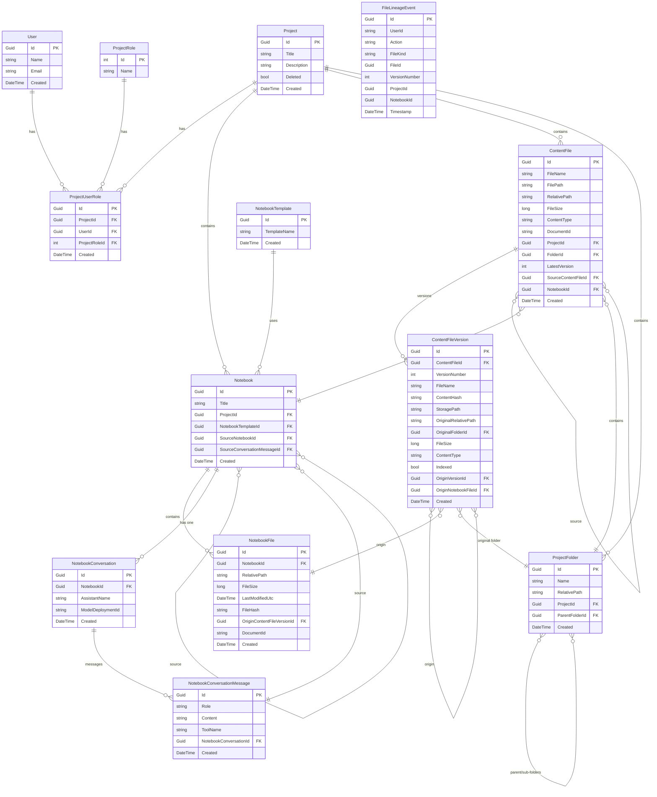

# GuideAntsApi.DataModel

This project contains the Entity Framework data models and DbContext for the GuideAnts API.

## Entity Relationship Diagram

The following diagram shows the relationships between the core entities in the data model.

